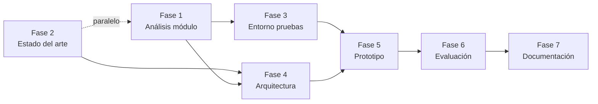

# Roadmap del proyecto

Este documento define las fases de ejecución del proyecto de detección y triaje inteligente de eventos de seguridad, derivadas de los objetivos generales descritos en [planDeTrabajoActualizado.md](./planDeTrabajoActualizado.md).

---

## Visión general

| Fase | Nombre | Objetivo asociado | Resultado esperado |
|------|--------|-------------------|--------------------|
| 1 | Análisis del módulo propietario | Objetivo 1 | Conocimiento operativo del sistema base y mapa de limitaciones |
| 2 | Estado del arte | Objetivo 2 | Marco de referencia MDR/XDR e IA aplicada a ciberseguridad |
| 3 | Entorno de pruebas | Objetivo 3 | Módulo operativo con dataset etiquetado y privacidad garantizada |
| 4 | Diseño de arquitectura | Objetivo 4 | Especificación del flujo, reglas, integraciones, métricas y baseline |
| 5 | Implementación del prototipo | Objetivo 5 | Caso de uso acotado con clasificación, priorización y razonamiento explicable |
| 6 | Evaluación | Objetivo 6 | Resultados medidos frente a método tradicional de referencia |
| 7 | Documentación técnica | Objetivo 7 | Informe final con arquitectura, decisiones, resultados y trabajo futuro |

La correspondencia es uno a uno: cada fase implementa exactamente un objetivo general del plan de trabajo. Lo que queda **fuera** del alcance del proyecto se detalla en la sección [Trabajo futuro](#trabajo-futuro-post-proyecto) y coincide con el alcance declarado en el plan de trabajo.

---

## Fase 1 — Análisis del módulo propietario

**Objetivo:** Comprender la solución actual de recepción y análisis de alertas, identificando capacidades, limitaciones y vacíos funcionales.

### Actividades

- [ ] Obtener acceso y documentación interna del módulo propietario.
- [ ] Recorrer el flujo completo: ingesta de alertas → procesamiento → salida/acción.
- [ ] Identificar formatos de entrada y salida soportados (tipos de eventos, esquemas, APIs).
- [ ] Documentar limitaciones actuales (falsos positivos, falta de priorización, ausencia de explicabilidad, etc.).
- [ ] Definir el caso de uso acotado sobre el cual se construirá el prototipo.

### Entregables

- Informe de análisis del módulo (capacidades, limitaciones, oportunidades de mejora).
- Definición preliminar del caso de uso seleccionado.

### Criterio de cierre

El equipo puede operar el módulo de forma básica y tiene documentadas las brechas que el prototipo debe cubrir.

---

## Fase 2 — Revisión del estado del arte

**Objetivo:** Analizar soluciones MDR/XDR existentes y el uso de modelos de lenguaje en ciberseguridad para fundamentar las decisiones de diseño.

### Actividades

- [ ] Revisar plataformas MDR/XDR del mercado (arquitectura, correlación, triaje, respuesta).
- [ ] Investigar aplicaciones de LLM en SOC: clasificación de alertas, resumen de incidentes, razonamiento explicable.
- [ ] Comparar ventajas y limitaciones de enfoques basados en reglas vs. enfoques asistidos por IA.
- [ ] Identificar necesidades no cubiertas por herramientas actuales, especialmente en PYMEs.
- [ ] Extraer criterios de diseño aplicables al prototipo (privacidad, validación humana, explicabilidad).

### Entregables

- Documento de estado del arte con tabla comparativa de soluciones y referencias bibliográficas.
- Lista de requisitos funcionales y no funcionales derivados del análisis.

### Criterio de cierre

Existen requisitos claros que guían el diseño y la evaluación del prototipo.

> **Nota:** Esta fase puede ejecutarse en paralelo con la Fase 1 para optimizar tiempos.

---

## Fase 3 — Configuración del entorno de pruebas

**Objetivo:** Instalar y poner en funcionamiento el módulo propietario con casos de prueba, garantizando que los datos no salgan a servicios externos, y disponer de un dataset etiquetado que sirva como referencia de evaluación.

### Actividades

- [ ] Definir la infraestructura local o aislada (contenedores, VMs, red restringida).
- [ ] Instalar y configurar el módulo propietario en el entorno de pruebas.
- [ ] Diseñar y desplegar el **sandbox de red FTTx emulada** con Containerlab, con la topología versionada en el repositorio.
- [ ] Incorporar a la topología nodos con **vulnerabilidades documentadas** que sirvan de ground truth para la evaluación.
- [ ] Desplegar el **auditor de vulnerabilidades** (Nmap + Greenbone) en el plano de gestión y fijar la versión del feed usada en la campaña.
- [ ] Desplegar **Wazuh** dentro del sandbox como fuente de alertas del entorno: agentes en los nodos Linux y reenvío de syslog desde el CPE. El manager se despliega **sin indexer ni dashboard**. Wazuh es infraestructura de ingestión, no sustituye al prototipo de triaje.
- [ ] Adoptar el **nivel de regla de Wazuh como método tradicional de referencia (baseline)** de la Fase 6, y registrarlo junto a cada alerta.
- [ ] Configurar el modelo de lenguaje de forma local o en entorno controlado (sin envío de datos sensibles a terceros), según el perfil de despliegue seleccionado en la Fase 4.
- [ ] **Verificar empíricamente el consumo de recursos** del entorno (sandbox, Greenbone y modelo) frente al presupuesto de memoria del equipo disponible.
- [ ] Preparar un conjunto de alertas de prueba representativas del caso de uso (incluyendo verdaderos positivos y falsos positivos).
- [ ] **Etiquetar el dataset de alertas** (ground truth) contrastando cada alerta de Wazuh contra el inventario documentado de vulnerabilidades del nodo al que apunta, y documentar el procedimiento.
- [ ] **Particionar el dataset** en entrenamiento y evaluación con nodos o campañas disjuntos, si el perfil elegido requiere fine-tuning.
- [ ] Validar conectividad, permisos y flujo end-to-end con datos sintéticos o anonimizados.
- [ ] Documentar procedimiento de despliegue y variables de configuración.

### Entregables

- Entorno de pruebas operativo y reproducible.
- Topología del sandbox definida como código (`.clab.yml`) y versionada, con el inventario de vulnerabilidades esperadas por nodo.
- Dataset de prueba **etiquetado** y documentado (origen, volumen, criterio y distribución de etiquetas).
- Guía de instalación y configuración del entorno.

### Criterio de cierre

El entorno procesa alertas de prueba de punta a punta sin dependencias externas no autorizadas y el dataset cuenta con ground truth suficiente para calcular precisión, recall y F1 en la Fase 6.

---

## Fase 4 — Diseño de la arquitectura del sistema

**Objetivo:** Definir el flujo de acciones, reglas de negocio, formas de interacción con herramientas externas e internas, y las métricas y el baseline contra los que se evaluará el prototipo.

### Actividades

- [ ] Diseñar el diagrama de arquitectura (componentes, flujos de datos, puntos de integración).
- [ ] Documentar el flujo **logs → playbook → EDR → sandbox → auditoría**, identificando qué componentes ya existen y cuáles se construyen.
- [ ] Definir el pipeline de triaje: recepción → enriquecimiento → clasificación → priorización → justificación → validación humana.
- [ ] Establecer reglas de decisión y umbrales (cuándo escalar, cuándo requerir revisión humana).
- [ ] Especificar el formato de salida del razonamiento explicable (campos, nivel de detalle, trazabilidad).
- [ ] Definir los puntos de validación humana dentro del flujo (qué decisiones la requieren y cómo se registran).
- [ ] Definir interfaces con el módulo propietario y posibles herramientas auxiliares.
- [ ] **Seleccionar el protocolo de comunicación EDR ↔ sandbox** y especificar el contrato de la orden de acción (idempotencia y trazabilidad).
- [ ] Definir el **catálogo cerrado de acciones** ejecutables: precondiciones, efecto esperado, reversibilidad y verificación de cada una.
- [ ] Diseñar el **auditor de vulnerabilidades** y el formato normalizado de sus hallazgos, independiente de la herramienta de escaneo.
- [ ] **Seleccionar el modelo de análisis** y definir los perfiles de despliegue según el hardware disponible.
- [ ] Especificar la **interfaz de análisis** (`clasificar` / `justificar`) que aísla al EDR del modelo concreto que la implementa.
- [ ] **Definir las métricas de evaluación** (precisión, recall, F1, tasa de falsos positivos, tiempo de triaje, etc.) y cómo se calculan sobre el dataset etiquetado de la Fase 3.
- [ ] **Definir el método tradicional de referencia (baseline)**: el nivel de regla de Wazuh, y cómo se compara con la clasificación del prototipo.
- [ ] Documentar decisiones de diseño y alternativas descartadas.

### Entregables

- Diagrama de arquitectura y flujo de datos.
- Especificación de reglas de triaje y criterios de priorización.
- Contrato de interfaces (APIs, esquemas de mensajes).
- Catálogo de acciones y contrato del conector EDR ↔ sandbox.
- Especificación del auditor y formato normalizado de hallazgos.
- Selección del modelo de análisis, perfiles de despliegue e interfaz de análisis.
- Plan de evaluación: métricas, forma de cálculo y definición del baseline.

### Criterio de cierre

La arquitectura está validada internamente y es suficiente para iniciar la implementación del prototipo, y la implementación se inicia sabiendo contra qué métricas y qué baseline será medida.

---

## Fase 5 — Implementación del prototipo

**Objetivo:** Construir el caso de uso acotado que clasifica, prioriza y justifica alertas con validación humana en decisiones críticas.

### Actividades

- [ ] Implementar el módulo de ingesta y normalización de alertas.
- [ ] Integrar el componente de análisis inteligente mediante la **interfaz de análisis**, con prompts y contexto acotado al caso de uso.
- [ ] Implementar el perfil de despliegue seleccionado: camino **interactivo** (encoder y modelo de 3B junto al sandbox) y camino **en lote** (modelo de 8B y Greenbone, separados en el tiempo).
- [ ] Desarrollar la lógica de clasificación y priorización de alertas.
- [ ] Implementar la generación de justificación explicable para cada decisión.
- [ ] Incorporar el flujo de validación humana para alertas de alta criticidad o baja confianza.
- [ ] Implementar el **conector EDR ↔ sandbox** sobre el protocolo seleccionado, limitado al catálogo cerrado de acciones.
- [ ] Implementar el **auditor de vulnerabilidades** y la normalización de sus hallazgos.
- [ ] Registrar logs y trazas para auditoría y evaluación posterior.
- [ ] Realizar pruebas unitarias e integración sobre el dataset de prueba.

### Entregables

- Prototipo funcional desplegado en el entorno de pruebas.
- Conjunto de prompts/reglas de inferencia documentados.
- Conector y auditor operativos sobre el sandbox.
- Logs de ejecución sobre el dataset de prueba.

### Alcance explícito (fuera de esta fase)

- Respuesta automatizada ante incidentes **sobre infraestructura productiva**.
- Integración multicapa en producción.

> **Sobre el sandbox.** Las acciones que el EDR ejecuta sobre el sandbox son un mecanismo de **validación en entorno controlado**, no respuesta automatizada en producción. Su finalidad es medir la calidad de la decisión, no remediar incidentes reales. La respuesta automatizada sobre equipos productivos se mantiene como trabajo futuro.

### Criterio de cierre

El prototipo procesa el dataset de prueba completo y produce clasificaciones priorizadas con justificación explicable.

---

## Fase 6 — Evaluación del prototipo

**Objetivo:** Medir el desempeño del sistema frente a escenarios de prueba y compararlo con el método tradicional de referencia, empleando las métricas y el baseline definidos en la Fase 4.

### Actividades

- [ ] Implementar el cálculo de las métricas definidas en la Fase 4 sobre el dataset etiquetado.
- [ ] Ejecutar el prototipo y el método de referencia sobre el mismo dataset.
- [ ] Recopilar feedback de validación humana sobre decisiones críticas.
- [ ] Analizar resultados: casos de éxito, errores sistemáticos, limitaciones del enfoque.
- [ ] Documentar conclusiones y recomendaciones de mejora.

### Entregables

- Informe de evaluación con métricas comparativas (prototipo vs. referencia).
- Análisis de errores y casos representativos.
- Recomendaciones para iteraciones futuras.

### Criterio de cierre

Existen resultados cuantitativos y cualitativos que demuestran el valor (o las limitaciones) del enfoque propuesto.

---

## Fase 7 — Documentación técnica e informe final

**Objetivo:** Consolidar la arquitectura, decisiones de diseño, resultados, limitaciones y líneas de trabajo futuro en un informe técnico completo.

### Actividades

- [ ] Redactar la documentación de arquitectura final (diagramas, componentes, flujos).
- [ ] Documentar decisiones de diseño y su justificación.
- [ ] Integrar resultados de evaluación y análisis del estado del arte.
- [ ] Describir limitaciones conocidas del prototipo y del enfoque.
- [ ] Proponer líneas de trabajo futuro (respuesta automatizada, integración multicapa, escalabilidad).
- [ ] Revisar y validar la documentación con el equipo de la empresa.

### Entregables

- Informe técnico final del proyecto.
- Documentación de arquitectura y operación del prototipo.
- Roadmap de trabajo futuro.

### Criterio de cierre

La documentación está completa, revisada y lista para entrega o presentación.

---

## Dependencias entre fases

---

## Trabajo futuro (post-proyecto)

Estas líneas quedan fuera del alcance del prototipo actual pero deben quedar documentadas como evolución natural del sistema:

1. **Respuesta automatizada:** Playbooks de remediación ante alertas confirmadas.
2. **Integración multicapa en producción:** Correlación de eventos de red, endpoints e identidad (visión XDR).
3. **Aprendizaje continuo:** Retroalimentación del analista para mejorar clasificación y priorización.
4. **Escalabilidad operativa:** Despliegue en entornos de clientes PYME con requisitos de bajo costo operativo.
