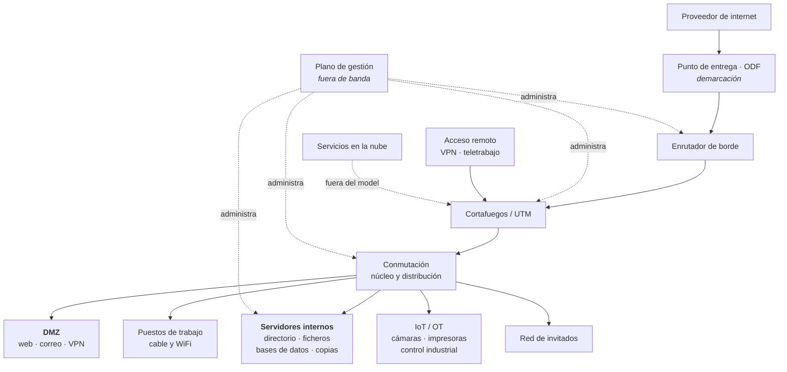

# Modelo de cliente genérico

Este documento define el **cliente de referencia** del proyecto: cómo es la infraestructura de red
de una empresa cualquiera, qué sistema de análisis de alertas tiene hoy, qué limitaciones arrastra
y qué cambia al pasar de una empresa a otra.

Es el entregable central de la [Fase 1](./README.md). Sustituye al análisis de un módulo
propietario real, que no existe, y da a las fases posteriores lo que esperaban de ella: un
perímetro, unas limitaciones y una lista explícita de supuestos.

---

## 1. Por qué se modela en vez de analizar

Analizar un cliente concreto produce un prototipo que sirve para ese cliente. Modelar el cliente
genérico obliga a una separación que de otro modo no se haría nunca:

- **Lo que el prototipo puede asumir de cualquier empresa** — y por tanto puede grabar en su
  diseño.
- **Lo que cambia de una empresa a otra** — y por tanto tiene que quedar configurable.

Esa frontera es el resultado útil de esta fase. Todo lo que quede del lado equivocado se paga
después: si se asume algo que en realidad varía, el prototipo solo funciona en un cliente; si se
hace configurable algo que nunca cambia, se paga complejidad a cambio de nada.

---

## 2. La infraestructura de red de una empresa cualquiera

Las empresas se parecen más de lo que sugiere su tamaño. Casi todas repiten la misma estructura
por capas, y lo que cambia entre una de veinte empleados y una de dos mil es **cuántas cajas hay
en cada capa**, no qué capas hay.

### Las capas, una a una

| Capa | Qué hay | Qué expone en gestión | Si se interrumpe |
|------|---------|----------------------|------------------|
| **Punto de entrega (ODF)** | Terminación del circuito del proveedor | Nada propio: es demarcación | Cae todo. Fuera del control del cliente |
| **Borde** | Enrutador de borde, a veces gestionado por el proveedor | SSH, interfaz web, SNMP, a veces gestión remota del proveedor | Cae toda la conectividad exterior |
| **Perímetro** | Cortafuegos o UTM, publicación de servicios, VPN | Consola de administración, API, SSH | Se cae el acceso remoto y la publicación de servicios |
| **Conmutación** | Switches de núcleo y de acceso, controladoras WiFi | SSH, web, SNMP | Cae el segmento afectado; el núcleo, la red entera |
| **DMZ** | Web, correo, portal de clientes, concentrador VPN | SSH, paneles de administración | **Lo ve el cliente del cliente.** Impacto externo inmediato |
| **Servidores internos** | Directorio, DNS y DHCP, ficheros, bases de datos, ERP, copias de seguridad, hipervisores | SSH, RDP, consolas de virtualización, agentes de copia | Se paran los procesos internos. El directorio arrastra a todo lo demás |
| **Puestos** | PC, portátiles, teléfonos | Escritorio remoto, herramientas de gestión de flota | Afecta a personas concretas, no al servicio |
| **IoT / OT** | Cámaras, impresoras, control de acceso, equipamiento industrial | Telnet, web sin cifrar, credenciales de fábrica | Depende: una impresora no es nada, una línea de producción lo es todo |
| **Invitados** | Segmento aislado para visitas | Poco o nada propio | Impacto bajo |
| **Plano de gestión** | Red fuera de banda por donde se administra el resto | Es, por definición, superficie de gestión | Se pierde la capacidad de administrar y de responder |

### Los tres hechos que este modelo aporta al diseño

**Primero: la superficie de gestión está en todas partes.** Cada capa expone alguna forma de
administración remota, y esa es exactamente la superficie del caso de uso acotado. No hay que
elegir un equipo privilegiado: hay que reconocer un tipo de servicio que aparece en todos.

**Segundo: la criticidad no sigue al tamaño del equipo.** Un conmutador de acceso es barato y su
caída afecta a una planta entera; un servidor de ficheros es caro y su caída afecta a un
departamento. Cualquier priorización que ordene por tipo de equipo se equivoca. Hay que ordenar
por **lo que cuelga del equipo**.

**Tercero: hay una asimetría entre el interior y la DMZ.** Un corte en un puesto lo sufre una
persona; un corte en la DMZ lo sufre el cliente del cliente. Es la asimetría que obliga a que la
política de continuidad sea un parámetro y no una constante.

---

## 3. Cómo escala el modelo

El mismo modelo cubre empresas de tamaños muy distintos si se acepta que las capas se **colapsan**
en vez de desaparecer:

| Tamaño | Cómo se ve el modelo |
|--------|----------------------|
| **Pequeña** | Borde, cortafuegos y conmutación viven en una sola caja. Un servidor físico con todo virtualizado. Sin plano de gestión separado: se administra desde la propia LAN |
| **Mediana** | Cajas separadas, DMZ real, un puñado de servidores, WiFi con controladora, copias de seguridad dedicadas. Plano de gestión parcial |
| **Grande / multisede** | Varias sedes con el mismo patrón, enlazadas entre sí; núcleo redundado, plano de gestión completo, ventanas de mantenimiento formales |

Colapsar capas **empeora la restricción de continuidad en vez de aliviarla**: cuando borde,
cortafuegos y conmutación son el mismo equipo, cualquier acción sobre él afecta a todo a la vez, y
no hay ninguna acción localizada disponible. La empresa pequeña es el caso difícil, no el fácil.

---

## 4. Qué sistema tiene hoy el cliente

Lo que el plan de trabajo llama **módulo propietario** se modela como el par que la empresa ya
tiene funcionando antes de que llegue este proyecto:

| Pieza | Responsabilidad |
|-------|-----------------|
| **Sistema de logs y correlación** | Recoge eventos de los equipos de la red, aplica reglas y firmas, y emite alertas con una severidad propia |
| **Playbook de orquestación** | Ordena el flujo: recibe la alerta, reúne el contexto y se la entrega a quien deba decidir |

El prototipo se coloca **después del segundo y antes de la respuesta**: recibe la alerta ya
orquestada, decide, justifica y propone una acción.

### Los tres supuestos

De ese sistema el prototipo asume tres cosas, y **no puede asumir ninguna más**:

1. **Emite alertas normalizables** — con marca de tiempo, algún identificador del activo
   implicado, una descripción del evento y una severidad propia. El esquema concreto varía; la
   existencia de estos cuatro elementos, no.
2. **Expone un canal de acción acotado** sobre los equipos de su red, con credenciales de servicio
   y un repertorio finito de operaciones.
3. **Declara qué no puede interrumpirse** — aunque sea de forma informal, en la cabeza del
   administrador. El prototipo necesita que eso se escriba.

El tercero es el que suele faltar en un cliente real, y el que más trabajo de puesta en marcha
genera. Conviene tratarlo como parte de la implantación, no como un dato disponible.

---

## 5. Limitaciones

Dos familias, con dueños y consecuencias distintas. Confundirlas lleva a prometer resolver algo
que no se puede tocar.

### 5.1 Del sistema base — lo que el prototipo viene a cubrir

| # | Limitación | Consecuencia |
|---|------------|--------------|
| L1 | **Clasifica por regla y firma, sin contexto del activo.** La misma alerta puntúa igual sobre un servidor expuesto y sobre uno que no lo está | Falsos positivos que consumen atención sin aportar riesgo |
| L2 | **Severidad fija por regla**, no prioridad calculada sobre el riesgo real | La cola se ordena por gravedad teórica y no por lo que de verdad importa hoy |
| L3 | **Sin justificación explicable.** La alerta dice qué regla saltó, no por qué eso importa aquí | El analista rehace el análisis a mano; el conocimiento no se acumula |
| L4 | **Sin noción de coste operativo.** Nada en el sistema distingue una respuesta inocua de una que cortaría un servicio | La decisión de responder recae íntegra en la persona, sin apoyo |
| L5 | **Correlación limitada al ámbito de sus reglas.** Eventos relacionados en equipos distintos llegan como alertas sueltas | Se pierde la lectura de incidente; se tratan síntomas por separado |

L1 a L4 son las brechas que el prototipo se compromete a cubrir. **L5 no**: mejorar la correlación
multicapa está declarado trabajo futuro en el plan, y conviene que conste aquí para que nadie lo
espere del prototipo.

### 5.2 Operativas del cliente — lo que el prototipo debe respetar

| # | Restricción | Qué impone al diseño |
|---|-------------|----------------------|
| C1 | **Continuidad.** Los servicios que la empresa presta y las conexiones de sus usuarios no se detienen | Toda acción se clasifica por su impacto sobre el servicio antes de poder ejecutarse |
| C2 | **Sin ventana de mantenimiento** sobre equipos en producción; en empresas pequeñas no existe siquiera el concepto | No se puede diferir una acción disruptiva a «esta noche» |
| C3 | **Sin manos en el equipo.** La actuación es remota. Una acción mal aplicada deja el equipo inalcanzable y exige presencia física | **La reversibilidad es obligatoria**, y debe poder verificarse desde el mismo canal que aplicó la acción |
| C4 | **Privacidad** del tráfico y de los datos que atraviesan la red | El análisis ocurre en local; los datos no salen a servicios externos |
| C5 | **Parque heterogéneo.** Distintos fabricantes, sistemas y versiones detrás de una misma intención de respuesta | El sistema emite **acciones abstractas**; la traducción a comandos concretos vive aparte |
| C6 | **El plano de gestión es la vía de respuesta y a la vez un objetivo.** Se administra por donde también se ataca | Una acción no puede cortar el canal por el que se seguirá respondiendo |

C3 y C6 son las dos que más forma dan al diseño y las que menos se enuncian en la literatura de
producto. C3 convierte la reversibilidad en requisito y no en buena práctica. C6 impone una
precondición a toda acción: **no dejar el equipo inalcanzable para la siguiente**.

### 5.3 Cómo se relacionan

Las dos familias no compiten y no se negocian entre sí. La primera dice **qué debe mejorar** el
prototipo; la segunda, **bajo qué condiciones no puede empeorar nada**. Una mejora de L1 que
vulnere C1 no es una mejora: un triaje que acierta más pero corta el servicio del cliente es peor
que el sistema que sustituye.

---

## 6. Puntos de variabilidad

Lo que cambia al pasar de este cliente de referencia a otro. Adaptarse a un cliente nuevo
significa **configurar estos cinco puntos**; nada más debería tener que tocarse.

### V1 · Esquema y transporte de la alerta
Cada sistema de logs tiene su formato, sus nombres de campo y su forma de entregar. Lo que no
varía son los cuatro elementos del supuesto 1.
**Configurable:** la correspondencia entre el esquema del cliente y el esquema común de entrada.

### V2 · Repertorio de respuestas y canal
Qué se puede hacer sobre los equipos de esa empresa, y por dónde. Un cliente admite SSH; otro solo
una API del fabricante; otro exige pasar por su propia herramienta de gestión.
**Configurable:** el catálogo de acciones disponibles y su traducción a cada tipo de equipo.

### V3 · Política de continuidad
Qué no puede interrumpirse, cuándo, y con qué margen. Es lo que más varía y lo que más consecuencias
tiene: la misma acción es rutinaria en una empresa y prohibida en otra.
**Configurable:** la clasificación de impacto de cada acción y el umbral a partir del cual una
decisión pasa por una persona.

### V4 · Inventario y criticidad de activos
Qué equipos hay y cuáles importan. Sin esto, priorizar es adivinar.
**Configurable:** el inventario y la criticidad asignada, usados para ordenar la cola.

### V5 · Severidad de referencia
Qué severidad asigna hoy el sistema del cliente. Es contra lo que se compara el prototipo para
demostrar que aporta algo.
**Configurable:** de qué campo sale y cómo se corresponde con la clasificación propia.

### Lo que no varía

Igual de importante, y más fácil de olvidar: **el flujo, la exigencia de justificación, la
obligación de trazar cada decisión, la reversibilidad de las acciones y la existencia de un punto
de validación humana no son configurables.** Son el sistema. Un cliente que pidiera saltárselos
estaría pidiendo otro producto.

---

## 7. Qué queda fuera del modelo

Se enuncia para que no se lea como olvido:

- **Servicios en la nube y SaaS.** Muchas empresas tienen ahí parte de su infraestructura, pero su
  telemetría y sus mecanismos de respuesta son de otra naturaleza. El modelo se detiene en el
  perímetro.
- **Seguridad de aplicación.** El código de lo que corre en los servidores no se analiza.
- **Identidad y usuarios.** Aunque el directorio aparece como activo crítico, el análisis de
  comportamiento de identidad queda declarado trabajo futuro en el plan.
- **El tramo del proveedor.** Antes del punto de entrega no hay nada que el cliente pueda auditar
  ni sobre lo que pueda actuar.

---

## Documentos relacionados

- [Caso de uso acotado](./caso-de-uso-acotado.md) — el perímetro concreto que se deriva de este modelo.
- [Fase 3 — Entorno de pruebas](../03-fase3-entorno-de-pruebas/) — cómo se instancia este cliente genérico en una red emulada.
- [Fase 2 — Requisitos](../02-fase2-estado-del-arte/requisitos.md) — los RF/RNF que estas limitaciones respaldan; C1, C3 y C6 se convierten en RF-17 a RF-19.
