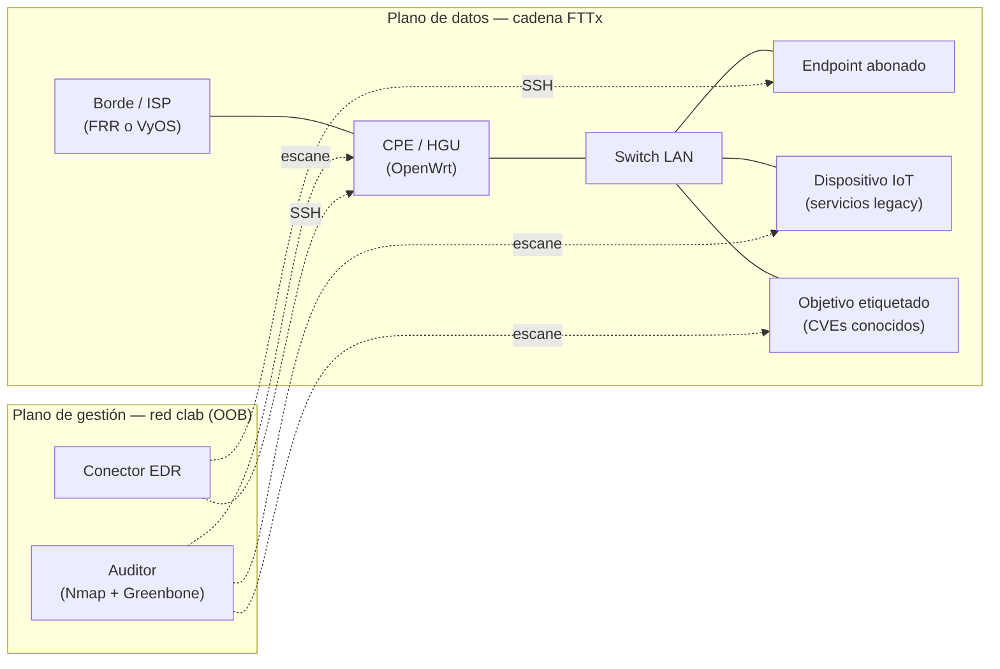

# Diseño del sandbox: red FTTx emulada con Containerlab

Este documento define el **entorno de pruebas** sobre el que operará el prototipo: una red emulada que reproduce la cadena de acceso FTTx, desde el borde del proveedor hasta el dispositivo del abonado.

> **Encuadre de alcance.** El sandbox es un **entorno controlado de validación**, no un despliegue productivo. El EDR decide y ejecuta acciones *aquí* para poder medir la calidad de esas decisiones. Esto no altera el alcance declarado en [planDeTrabajoActualizado.md](../00-general/planDeTrabajoActualizado.md): la respuesta automatizada sobre equipos reales sigue siendo trabajo futuro.

---

## 1. Qué se emula y qué no

La cadena FTTx completa va del OLT en la central del proveedor, a través de la red óptica pasiva, hasta la ONT en casa del abonado, el router/CPE y finalmente su PC o teléfono. No todos esos tramos son territorio útil para este proyecto:

| Tramo | Equipo | ¿En el sandbox? | Motivo |
|-------|--------|-----------------|--------|
| Central | OLT | No | Carrier-grade, propietario, fuera del alcance de un EDR |
| Red óptica | Splitters ODN | No | Elementos pasivos, sin software que auditar |
| Casa — óptica | ONT/ONU | No (se abstrae) | El plano de gestión relevante vive en el CPE |
| **Casa — red** | **Router / CPE / HGU** | **Sí — objetivo principal** | Firmware desactualizado, credenciales por defecto, servicios expuestos |
| Casa — LAN | Switch, WiFi, dispositivos IoT | Sí | Superficie lateral: propagación dentro del hogar |
| Final | PC / móvil del abonado | Sí | Objetivo clásico de EDR |

El centro de gravedad es el **CPE**. Es el equipo con mayor exposición real: firmware que rara vez se actualiza, credenciales de fábrica, y servicios de administración accesibles.

El OLT y la red óptica se **abstraen** en un único nodo de borde. Emular OMCI o el plano PON no aportaría nada al triaje de alertas y sí un coste de implementación considerable.

---

## 2. Elección de plataforma

Se evaluaron las plataformas de laboratorio de red disponibles:

| Plataforma | Coste | ¿Auditable? | Límite de nodos | Veredicto |
|------------|-------|-------------|-----------------|-----------|
| Cisco Packet Tracer | Gratis | **No** | — | **Descartado** |
| Cisco Modeling Labs — Free | Gratis | Sí | **5 (tope duro)** | Insuficiente |
| Cisco Modeling Labs — Personal | ~199 USD/año | Sí | 20 | Cisco-céntrico, sin CPE doméstico |
| GNS3 | Gratis | Sí | Según RAM | Alternativa válida |
| EVE-NG Community | Gratis | Sí | Según RAM | Alternativa válida |
| **Containerlab** | **Gratis** | **Sí** | Según RAM (muy ligero) | **Seleccionado** |

### Por qué se descarta Packet Tracer

Packet Tracer **simula** dispositivos: no ejecuta un sistema operativo real ni expone servicios reales. Un escaneo con Nmap o Greenbone no encontraría nada que analizar, porque no hay pila de red ni servicios genuinos detrás. Sirve para docencia de protocolos, no para investigación de vulnerabilidades. Esta distinción entre **simulación** y **virtualización/emulación** es la que descarta la herramienta.

### Por qué Containerlab

- **Topología como código.** La red se define en un fichero `.clab.yml` versionable en git. Esto satisface directamente el criterio de cierre de la Fase 3 ("entorno de pruebas operativo y **reproducible**"): el entorno deja de ser un estado de máquina difícil de reconstruir y pasa a ser un artefacto del repositorio.
- **Reset determinista.** `containerlab destroy && containerlab deploy` devuelve el laboratorio a un estado limpio y conocido en segundos. Imprescindible cuando cada caso de prueba debe partir del mismo punto para que las métricas de la Fase 6 sean comparables.
- **Red de gestión out-of-band incorporada.** Containerlab crea automáticamente una red Docker (`clab`) que conecta todos los nodos y que su documentación describe como un switch de gestión OOB. El EDR y el auditor viven ahí, separados del plano de datos que observan.
- **Soporta OpenWrt de forma nativa.** El `kind: openwrt` arranca una VM QEMU de OpenWrt empaquetada como contenedor, vía vrnetlab. Da un CPE con firmware real, no un sustituto.
- **Coste en recursos bajo.** Al ser mayoritariamente contenedores, la topología completa cabe en un portátil de desarrollo.

**Limitación aceptada:** Containerlab no tiene interfaz gráfica de arrastrar y soltar. La topología se edita en YAML. A cambio, es diffeable, revisable y reproducible — propiedades que una GUI no ofrece.

---

## 3. Topología propuesta



### Inventario de nodos

| Nodo | Rol | Base sugerida |
|------|-----|---------------|
| `borde` | Salida simulada a internet; abstrae OLT y red óptica | FRR o VyOS |
| `cpe` | **Objetivo principal.** Router doméstico / HGU | OpenWrt (`kind: openwrt`) |
| `sw-lan` | Segmento LAN del abonado | Bridge de host |
| `host-abonado` | PC del usuario final | Contenedor Linux con utilidades de red |
| `iot-legacy` | Dispositivo IoT con servicios antiguos expuestos | Contenedor con Telnet / UPnP / servicios obsoletos |
| `objetivo-vuln` | Objetivo con vulnerabilidades **documentadas** | Metasploitable / imagen de Vulhub |
| `auditor` | Escaneo de vulnerabilidades | Kali o contenedor con Nmap; Greenbone aparte (ver §5) |

### Separación de planos

El auditor y el conector del EDR se conectan por la **red de gestión** (`clab`), no por el plano de datos. Dos razones:

1. **Independencia operativa.** El EDR debe poder actuar sobre el CPE incluso si el plano de datos está degradado o comprometido — que es precisamente el escenario en el que hace falta.
2. **No contaminar la telemetría.** Si el tráfico de escaneo circulase por el mismo segmento que se está observando, el auditor generaría los eventos que el propio sistema debe analizar, sesgando la evaluación de la Fase 6.

---

## 4. Boceto de topología

> **Estado: sin validar.** Este fichero es un punto de partida para la Fase 3. Las etiquetas de imagen concretas, las versiones de OpenWrt y el cableado deben verificarse al desplegar. Las imágenes de vrnetlab requieren construirse localmente a partir del firmware correspondiente.

```yaml
name: fttx-sandbox

topology:
  nodes:
    borde:
      kind: linux
      image: frrouting/frr:latest

    cpe:
      kind: openwrt
      image: vrnetlab/openwrt_openwrt:<version>

    sw-lan:
      kind: bridge          # requiere un bridge del mismo nombre creado en el host

    host-abonado:
      kind: linux
      image: <imagen con utilidades de red>

    iot-legacy:
      kind: linux
      image: <imagen con servicios legacy expuestos>

    objetivo-vuln:
      kind: linux
      image: <imagen con CVEs documentados>

    auditor:
      kind: linux
      image: <imagen con Nmap y cliente de escaneo>

  links:
    - endpoints: ["borde:eth1", "cpe:eth1"]
    - endpoints: ["cpe:eth2", "sw-lan:eth1"]
    - endpoints: ["host-abonado:eth1", "sw-lan:eth2"]
    - endpoints: ["iot-legacy:eth1", "sw-lan:eth3"]
    - endpoints: ["objetivo-vuln:eth1", "sw-lan:eth4"]
```

Todos los nodos quedan además conectados automáticamente a la red de gestión `clab`, sin necesidad de declararlo.

---

## 5. Consideraciones de implementación

**Greenbone es multi-contenedor.** La distribución comunitaria de Greenbone se despliega como un conjunto de servicios coordinados (escáner, gestor, base de datos de feeds, interfaz web), no como una imagen única. Encajarlo como un nodo de Containerlab es forzado. La opción recomendada es **ejecutarlo fuera de la topología** y conectarlo al bridge de gestión `clab`, tratándolo como un servicio del entorno y no como un nodo del laboratorio. El nodo `auditor` de la topología queda entonces para Nmap y para la orquestación del escaneo.

**Sincronización del feed de vulnerabilidades.** La primera descarga del feed de Greenbone es lenta y voluminosa. Debe hacerse una vez y quedar persistida, no repetirse en cada `deploy`. Conviene además **fijar la versión del feed** usada en la evaluación: si el feed cambia entre la ejecución del prototipo y la del baseline, los resultados de la Fase 6 dejan de ser comparables.

**Las imágenes de vrnetlab se construyen localmente.** El `kind: openwrt` no descarga una imagen pública lista para usar: se construye a partir del firmware de OpenWrt mediante el proyecto vrnetlab. Es un paso previo al primer despliegue y debe quedar documentado en la guía de instalación.

**Aislamiento de red.** El laboratorio no debe tener salida a internet salvo la estrictamente necesaria (sincronización del feed). Esto responde al requisito de privacidad del objetivo 3: los datos no salen a servicios externos.

---

## 6. Los objetivos etiquetados resuelven el ground truth

Que no exista todavía una empresa cliente definida permite diseñar una **red de referencia genérica** en vez de replicar una infraestructura concreta. Esto habilita algo que de otro modo sería costoso: **plantar deliberadamente dispositivos con vulnerabilidades conocidas y documentadas**.

Al usar imágenes cuyos CVEs están publicados —Metasploitable, escenarios de Vulhub, una versión antigua y concreta de OpenWrt— se sabe de antemano:

- qué vulnerabilidades existen en cada nodo,
- qué debería detectar el auditor (verdaderos positivos esperados),
- qué **no** existe, y por tanto qué detección sería un falso positivo.

Eso es exactamente el **dataset etiquetado (ground truth)** que la Fase 3 exige como entregable y del que depende el cálculo de precisión, recall y F1 en la Fase 6. El etiquetado deja de ser un ejercicio manual de criterio y pasa a derivarse de la composición documentada de la topología.

Consecuencia de diseño: **la topología es el dataset**. Cada nodo añadido al `.clab.yml` debe registrarse junto con su inventario de vulnerabilidades esperadas.

---

## 7. Preguntas abiertas

- ¿Debe incluirse un endpoint Windows? Aporta realismo al tramo final y es el objetivo natural de un EDR, pero exige licencia y una VM completa, lo que rompe el modelo ligero de contenedores.
- ¿Qué versión de OpenWrt se fija como CPE? Debe ser lo bastante antigua para tener CVEs documentados, pero seguir arrancando de forma estable.
- ¿Cuántos hogares se emulan? La topología descrita modela **un** abonado. Varios CPE en paralelo permitirían estudiar correlación entre abonados, a costa de recursos.

---

## Referencias

- [Containerlab — documentación oficial](https://containerlab.dev/)
- [Containerlab — kind OpenWRT](https://containerlab.dev/manual/kinds/openwrt/)
- [Containerlab — red de gestión](https://containerlab.dev/manual/network/)
- [Containerlab — integración con vrnetlab](https://containerlab.dev/manual/vrnetlab/)
- [Cisco Modeling Labs — Free (DevNet)](https://developer.cisco.com/docs/modeling-labs/cml-free/)
- [Greenbone / OpenVAS](https://www.greenbone.net/en/openvas-scan/)
