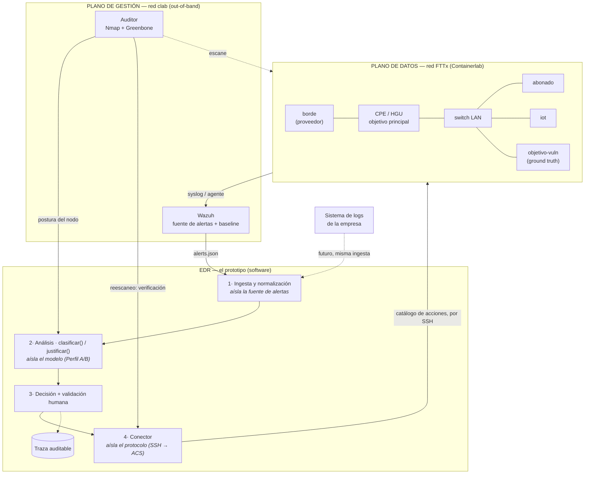

# Arquitectura consolidada

Vista única de todo el sistema: componentes, planos, flujo de datos y los puntos donde el diseño
se aísla de sus dependencias externas. Reúne lo repartido en los documentos de la Fase 4 y cierra
su diseño.

---

## Diagrama de componentes

---

## Los tres puntos de aislamiento

El diseño depende de tres cosas externas que hoy no están definidas o son provisionales. En vez
de acoplarse a ellas, el EDR las esconde tras un adaptador. Es el patrón que se repite y lo que
hace el sistema portable:

| Dependencia externa | Hoy | Mañana | Adaptador que lo aísla |
|---------------------|-----|--------|------------------------|
| Fuente de alertas | Wazuh en el sandbox | + sistema de la empresa | **Módulo de ingesta** |
| Modelo de análisis | Perfil A (híbrido, CPU) | Perfil B (Foundation-Sec-8B, GPU) | **Interfaz `clasificar`/`justificar`** |
| Canal hacia el objetivo | SSH | TR-069 / ACS | **Conector** |

Cambiar cualquiera de los tres es escribir un adaptador nuevo, **sin tocar la lógica de decisión
del EDR**. Es lo que permite empezar con lo disponible sin hipotecar el diseño.

---

## El flujo en una frase por etapa

1. **Actividad** en el sandbox (un ataque, un escaneo) →
2. **Wazuh** la convierte en alerta con nivel, IP y crudo →
3. **Ingesta** la normaliza al esquema del EDR (y la enriquece con la postura del auditor) →
4. **Análisis** la clasifica, prioriza y —si hace falta— justifica →
5. **Decisión**: acción directa, o retención para **validación humana** →
6. **Conector** ejecuta una acción del **catálogo cerrado** por SSH →
7. **Auditor** reescanea para **verificar** que la exposición se cerró →
8. Todo queda en la **traza**.

El ciclo es cerrado: la acción genera telemetría nueva que Wazuh vuelve a evaluar.

---

## Modos de ejecución (Perfil A)

Por el presupuesto de memoria medido, el flujo se parte en dos y **el dataset en disco es la
frontera**:

- **En vivo:** sandbox + Wazuh + encoder + modelo 3B. El lazo interactivo, demostrable.
- **En lote:** Greenbone + modelo 8B, con el sandbox apagado. Postura, justificación extensa y métricas.

---

## Trazabilidad a los documentos de diseño

| Componente | Documento |
|------------|-----------|
| Red FTTx y nodos | [sandbox](../03-fase3-entorno-de-pruebas/sandbox-red-containerlab.md) · [nodos](../../lab/README.md) |
| Flujo, contratos, validación humana | [flujo](./flujo-edr-playbook-sandbox.md) |
| Canal y protocolo | [protocolos](./protocolos-comunicacion-sandbox.md) |
| Auditor | [auditoría](./auditoria-de-vulnerabilidades-del-sandbox.md) |
| Modelo y perfiles | [selección del modelo](./seleccion-del-modelo.md) |
| Acciones | [catálogo](./catalogo-de-acciones.md) |
| Métricas y baseline | [métricas](./metricas-y-evaluacion.md) |
| Requisitos | [Fase 2](../02-fase2-estado-del-arte/limitacionesDeXDR.md) · [revisión FTTx](../02-fase2-estado-del-arte/revision-requisitos-fttx.md) |

---

## Estado de la Fase 4

Con este documento, el diseño de la arquitectura queda **cerrado**. Todo lo pendiente es
implementación (Fase 5) o depende de datos de la empresa (Fase 1). El único hueco de diseño
conocido es que el objetivo principal —el CPE— es provisional hasta desbloquear OpenWrt en
vrnetlab; las decisiones están tomadas para OpenWrt, solo falta poder probarlas sobre él.
