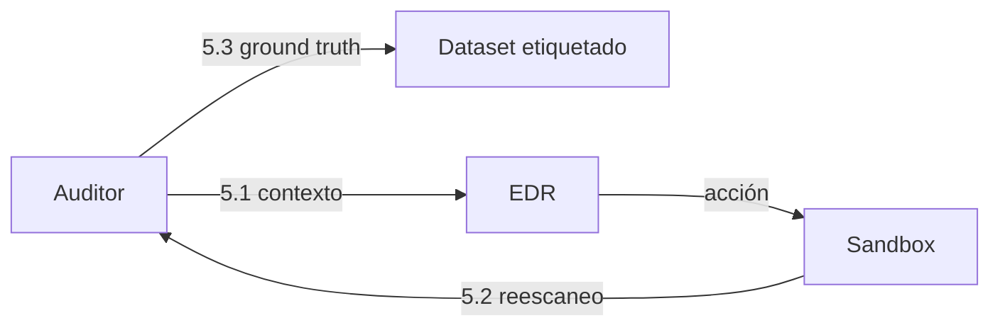

# Auditoría de vulnerabilidades del sandbox

El auditor es la **contraparte del EDR**: mientras el EDR reacciona a eventos, el auditor observa el estado del sistema y determina qué exposiciones existen. Este documento define su alcance, herramientas, salida y encaje en el flujo.

---

## 1. Alcance

La auditoría se limita a **escaneo de red**: descubrimiento de activos, identificación de servicios y detección de vulnerabilidades conocidas desde la red.

**Queda fuera** el análisis de firmware —extracción de imágenes, SBOM, búsqueda de credenciales embebidas, análisis estático de binarios—. Ese enfoque requiere disponer de las imágenes de firmware de los equipos desplegados, y no existiendo hoy un proveedor ni un parque de CPE definido, no hay firmware que analizar.

> Si en el futuro se dispusiera de imágenes de firmware reales, herramientas como EMBA cubrirían ese análisis. Queda anotado como trabajo futuro, no como parte de esta iteración.

---

## 2. Qué se audita

Sobre una red FTTx emulada, la superficie relevante:

| Categoría | Qué se busca | Dónde importa más |
|-----------|--------------|-------------------|
| Servicios expuestos | Puertos abiertos, servicios accesibles desde la LAN o desde el borde | CPE, IoT |
| Protocolos inseguros | Telnet, HTTP sin cifrar, SNMP con comunidad por defecto, UPnP | CPE, IoT |
| Gestión remota | CWMP (7547), interfaces de administración accesibles desde el lado WAN | CPE |
| Credenciales por defecto | Pares usuario/contraseña de fábrica sin cambiar | CPE, IoT |
| Software desactualizado | Versiones de servicios con CVEs publicados | Todos los nodos |
| Configuración débil | Cifrado obsoleto, servicios innecesarios activos | Todos los nodos |

El **CPE es el objetivo prioritario**: concentra la gestión remota, las credenciales de fábrica y el firmware que rara vez se actualiza.

---

## 3. Herramientas

**Nmap** — descubrimiento e inventario. Identifica hosts, puertos abiertos, servicios y versiones, y determina la superficie expuesta de cada nodo. Sus scripts NSE cubren algunas comprobaciones de vulnerabilidad conocidas, pero Nmap **dice qué hay, no si es vulnerable**: no sustituye a un escáner dedicado.

**Greenbone / OpenVAS** — escaneo de vulnerabilidades propiamente dicho. Correlaciona los servicios y versiones detectados contra su feed de vulnerabilidades y produce hallazgos con CVE y severidad asociada. Es exhaustivo y lento; es el motor que aporta el juicio de "esto es vulnerable".

Los dos son complementarios y ese es el reparto: **Nmap inventaría y acota, Greenbone dictamina**.

### Consideraciones operativas

- Greenbone se despliega como **varios servicios coordinados**, no como una imagen única. Se ejecuta fuera de la topología de Containerlab, conectado al bridge de gestión. Ver [diseño del sandbox §5](../03-fase3-entorno-de-pruebas/sandbox-red-containerlab.md).
- La **versión del feed debe fijarse** durante la campaña de evaluación. Si el feed cambia entre la ejecución del prototipo y la del baseline, los resultados de la Fase 6 dejan de ser comparables.
- El escaneo genera tráfico que parecería hostil a cualquier detector. Por eso el auditor opera desde el **plano de gestión**, no desde el plano de datos: no debe contaminar la telemetría que el sistema está analizando.

---

## 4. Salida normalizada

Nmap y Greenbone producen formatos distintos. El auditor debe emitir un resultado **normalizado**, independiente de la herramienta, para que el EDR no dependa del escáner concreto y para que sustituir Greenbone más adelante no obligue a tocar el EDR.

Campos mínimos por hallazgo:

| Campo | Descripción |
|-------|-------------|
| Nodo | Activo afectado dentro de la topología |
| Servicio / puerto | Dónde se manifiesta |
| Identificador | CVE cuando exista; identificador interno cuando no |
| Severidad | Escala normalizada, con la puntuación de origen preservada |
| Categoría | Según la tabla de la sección 2 |
| Evidencia | Qué observó el escáner |
| Herramienta y versión de feed | Trazabilidad y reproducibilidad |
| Marca de tiempo | Momento del escaneo |

Y a nivel de campaña: identificador del escaneo, alcance, duración y versión de la topología auditada.

---

## 5. Encaje en el flujo

El auditor cumple **tres funciones distintas**, y conviene no confundirlas:

### 5.1 Contexto de decisión (antes)

El resultado de la auditoría enriquece las alertas que llegan al EDR. Una alerta contra un nodo que **es efectivamente vulnerable** a lo que la alerta sugiere merece más prioridad que la misma alerta contra un nodo no afectado.

Esta es la contribución más valiosa del auditor: ataca directamente la **fatiga por falsos positivos** identificada en el [análisis de limitaciones de XDR](../02-fase2-estado-del-arte/limitacionesDeXDR.md). Buena parte del ruido de un SOC son alertas correctas cuyo objetivo no era explotable.

### 5.2 Verificación de la acción (después)

Tras ejecutarse una acción del EDR, un nuevo escaneo comprueba si la exposición se cerró realmente. Convierte "la acción se ejecutó sin error" en "la acción tuvo el efecto pretendido" — que no es lo mismo, y es la diferencia entre un registro de ejecución y una evidencia de remediación.

### 5.3 Generación del ground truth (una vez)

Un escaneo completo de la topología en estado limpio produce el **inventario de vulnerabilidades esperadas**. Contrastado con la composición documentada de la topología —los nodos plantados deliberadamente con CVEs conocidos— da el dataset etiquetado que la Fase 3 exige y sobre el que la Fase 6 calcula precisión, recall y F1.

---

## 6. Límite importante: el auditor no es infalible

El auditor es una herramienta de medida, y una herramienta de medida imperfecta contamina lo que mide. Dos consecuencias:

- **Como ground truth**, sus resultados deben **contrastarse con la composición documentada de la topología**, no aceptarse sin más. Si se etiqueta el dataset con la salida del escáner y luego se evalúa al prototipo contra esa etiqueta, se estaría midiendo el parecido con Greenbone, no la corrección.
- **Como contexto**, un escáner puede no detectar una vulnerabilidad presente. Ausencia de hallazgo no es prueba de que el nodo sea seguro, y el EDR no debe tratarla como tal al bajar la prioridad de una alerta.

Ambos puntos deben quedar recogidos como limitaciones conocidas en el informe de la Fase 7.

---

## 7. Preguntas abiertas

- ¿Con qué frecuencia se escanea? Un escaneo por campaña es reproducible; escaneo continuo es más realista pero introduce ruido y carga.
- ¿El escaneo es autenticado o no autenticado? El autenticado detecta mucho más, pero exige credenciales en cada nodo y se aleja del punto de vista de un atacante externo.
- ¿Los hallazgos del auditor generan alertas por sí mismos, o solo enriquecen las existentes? Afecta al volumen que el EDR debe procesar.

---

## Documentos relacionados

- [Flujo de operación: logs → playbook → EDR → sandbox](./flujo-edr-playbook-sandbox.md)
- [Diseño del sandbox: red FTTx con Containerlab](../03-fase3-entorno-de-pruebas/sandbox-red-containerlab.md)
- [Protocolos de comunicación con el sandbox](./protocolos-comunicacion-sandbox.md)
- [Limitaciones de XDR](../02-fase2-estado-del-arte/limitacionesDeXDR.md)

## Referencias

- [Greenbone / OpenVAS](https://www.greenbone.net/en/openvas-scan/)
- [Nmap](https://nmap.org/)
- [EMBA — analizador de seguridad de firmware](https://github.com/e-m-b-a/emba) (trabajo futuro)
