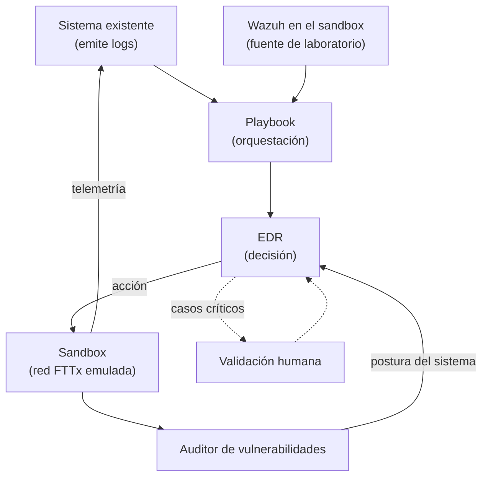

# Flujo de operación: logs → playbook → EDR → sandbox → auditoría

Este documento describe el flujo end-to-end del prototipo tal como fue planteado por la empresa, e identifica qué componentes ya existen, cuáles hay que construir y dónde encajan las decisiones del objetivo 4 del [plan de trabajo](../00-general/planDeTrabajoActualizado.md).

---

## 1. El flujo

El ciclo es cerrado: el sandbox genera telemetría, esa telemetría alimenta al sistema de logs, y el resultado de la auditoría vuelve al EDR como contexto para la siguiente decisión.

---

## 2. Componentes

| Componente | Estado | Responsabilidad |
|------------|--------|-----------------|
| Sistema de logs | **Ya existe** (propietario) — no disponible hoy | Recoger y emitir eventos de seguridad |
| **Wazuh** (sustituto de laboratorio) | **A desplegar** — ver [sandbox §5.1](../03-fase3-entorno-de-pruebas/sandbox-red-containerlab.md) | Generar alertas reales sobre el sandbox y aportar el **baseline** de reglas |
| Playbook | **Ya existe** | Orquestar el flujo y entregar información al EDR |
| EDR | **A construir** | Clasificar, priorizar, justificar y decidir la acción |
| Sandbox | **A construir** — ver [diseño del sandbox](../03-fase3-entorno-de-pruebas/sandbox-red-containerlab.md) | Ejecutar la acción y generar telemetría observable |
| Conector EDR ↔ sandbox | **A construir** | Transportar la acción y devolver su resultado |
| Auditor de vulnerabilidades | **A construir** — ver [auditoría](./auditoria-de-vulnerabilidades-del-sandbox.md) | Determinar la postura de seguridad del sandbox |
| Validación humana | **A construir** | Aprobar decisiones críticas o de baja confianza |

Los dos primeros son entrada dada: el proyecto **no** los rediseña. Lo que se construye empieza en el EDR.

---

## 3. Responsabilidad de cada componente

### Sistema de logs (existente) y su sustituto de laboratorio

Fuente primaria de eventos. Para la Fase 1 hace falta documentar su **formato de salida real**: esquema de los eventos, campos disponibles, mecanismo de entrega y volumen. Sin ese dato, el módulo de ingesta del EDR no puede especificarse.

**Mientras ese sistema no esté disponible, el proyecto no puede quedarse sin entrada.** Se despliega **Wazuh dentro del sandbox** como fuente de alertas de laboratorio: agentes en los nodos Linux y reenvío de syslog desde el CPE OpenWrt. Además de desbloquear el flujo, su **nivel de regla proporciona el baseline** contra el que la Fase 6 debe comparar el prototipo.

No es un parche provisional que haya que retirar: cuando el sistema de la empresa esté disponible, se integra como **segunda fuente** a través del mismo módulo de ingesta normalizada, sin desplazar a Wazuh.

### Playbook (existente)
Actúa como orquestador entre el sistema de logs y el EDR. Es necesario determinar **qué información entrega exactamente** y si el flujo es síncrono (espera la decisión del EDR) o asíncrono (dispara y olvida). Esta distinción determina si el EDR puede permitirse la latencia de una inferencia con modelo de lenguaje y la de una validación humana.

### EDR (a construir)
El núcleo del proyecto. Recibe el evento enriquecido, lo clasifica y prioriza, produce una **justificación explicable**, y decide la acción. No ejecuta nada por sí mismo: emite una **orden de acción** que el conector transporta.

Separar decisión de ejecución mantiene el EDR auditable y comprobable de forma aislada: se puede evaluar la calidad de sus decisiones sin ejecutar nada.

### Sandbox (a construir)
Entorno controlado donde la acción se ejecuta y donde su efecto puede observarse y medirse. Detalle completo en el [diseño del sandbox](../03-fase3-entorno-de-pruebas/sandbox-red-containerlab.md).

### Auditor (a construir)
Contraparte del EDR. Escanea el sandbox y devuelve su postura de seguridad, que sirve tanto de **contexto de decisión** (¿el equipo afectado es vulnerable a lo que la alerta sugiere?) como de **verificación** (¿la acción cerró realmente la exposición?).

---

## 4. Contratos entre componentes

La arquitectura descansa en dos contratos. Especificarlos es entregable de la Fase 4.

### Playbook → EDR (entrada)

Debe transportar como mínimo: identificador del evento, marca de tiempo, activo afectado dentro de la topología, tipo de evento, datos crudos originales y la severidad que asignó el sistema de origen. Este último campo es importante: es el **baseline** contra el que la Fase 6 comparará la clasificación del prototipo.

### EDR → sandbox (orden de acción)

Debe transportar: identificador de la decisión (trazable hasta el evento que la originó), nodo objetivo, acción a ejecutar, parámetros, si requiere validación humana previa, y la justificación explicable que la sustenta.

Dos propiedades no negociables:

- **Idempotencia.** Reejecutar la misma orden no debe producir un efecto distinto. Sin esto, un reintento tras un fallo de red puede dejar el sandbox en un estado que no corresponde a ninguna decisión.
- **Trazabilidad completa.** Toda orden debe ser reconstruible hasta el evento de origen y hasta la justificación que la motivó. Es requisito de auditoría y es la base de la evaluación de la Fase 6.

El transporte concreto se analiza en [protocolos de comunicación](./protocolos-comunicacion-sandbox.md).

---

## 5. Catálogo de acciones

Las acciones que el EDR puede ordenar deben ser un **conjunto cerrado y enumerado**, no comandos arbitrarios. Un catálogo cerrado es auditable, comprobable y acotado en su radio de impacto; un canal de comandos libres no lo es.

Categorías previstas sobre una red FTTx:

| Categoría | Ejemplos | Reversible |
|-----------|----------|------------|
| Observación | Capturar tráfico, volcar tabla de conexiones, recoger configuración | Sí (sin efecto) |
| Contención de red | Bloquear destino, aislar un nodo de la LAN, limitar ancho de banda | Sí |
| Endurecimiento | Cerrar un servicio expuesto, forzar cambio de credenciales por defecto | Parcialmente |
| Remediación | Reiniciar el equipo, restaurar configuración conocida | Sí, con impacto |

Para cada acción hay que documentar: precondiciones, efecto esperado, cómo revertirla y cómo verificar que se aplicó. Las acciones **no reversibles o de alto impacto** son candidatas naturales a requerir validación humana.

---

## 6. Dónde encaja la validación humana

El plan de trabajo exige validación humana en decisiones críticas. En este flujo se sitúa **entre la decisión del EDR y la ejecución en el sandbox**: el EDR emite la orden, esta queda retenida, y solo se transmite al conector tras aprobación.

Criterios candidatos para exigirla (los umbrales concretos son entregable de la Fase 4):

- La acción no es reversible o interrumpe el servicio del abonado.
- La confianza del clasificador queda por debajo de un umbral.
- La clasificación y la severidad del sistema de origen **discrepan** — señal de que uno de los dos se equivoca, y merece un ojo humano.

Cada decisión de validación (aprobada, rechazada, modificada) debe registrarse: alimenta el análisis cualitativo de la Fase 6 y es la semilla del aprendizaje continuo listado como trabajo futuro.

---

## 7. Preguntas abiertas para la empresa

Estas respuestas son entrada de la Fase 1 y bloquean partes del diseño:

1. **¿Cuál es el formato exacto de salida del sistema de logs?** Bloquea la especificación del módulo de ingesta.
2. **¿El playbook espera respuesta del EDR, o es asíncrono?** Determina el presupuesto de latencia y la viabilidad de la validación humana en línea.
3. **¿Qué severidad o clasificación asigna hoy el sistema existente?** Serviría como segundo baseline de comparación. Mientras tanto, el baseline es el nivel de regla de Wazuh.
4. **¿Existe ya un catálogo de acciones que el playbook sepa ejecutar?** Si existe, el catálogo del EDR debe alinearse con él en vez de inventar uno nuevo.

---

## Documentos relacionados

- [Diseño del sandbox: red FTTx con Containerlab](../03-fase3-entorno-de-pruebas/sandbox-red-containerlab.md)
- [Protocolos de comunicación con el sandbox](./protocolos-comunicacion-sandbox.md)
- [Auditoría de vulnerabilidades del sandbox](./auditoria-de-vulnerabilidades-del-sandbox.md)
- [Limitaciones de XDR](../02-fase2-estado-del-arte/limitacionesDeXDR.md)
