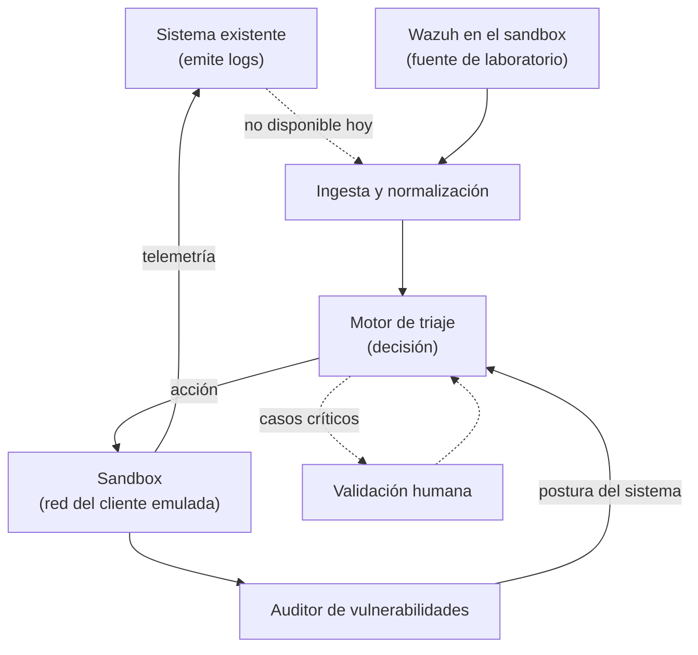
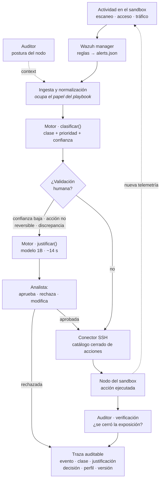
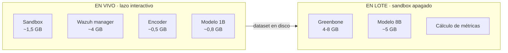

# Flujo de operación: logs → playbook → motor de triaje → sandbox → auditoría

Este documento describe el flujo end-to-end del prototipo tal como fue planteado por la empresa, e identifica qué componentes ya existen, cuáles hay que construir y dónde encajan las decisiones del objetivo 4 del [plan de trabajo](../00-general/planDeTrabajoActualizado.md).

>
> **Terminología.** El componente central que este proyecto construye se llama **motor de triaje**
> (el «módulo de triaje inteligente» del plan de trabajo). No es un **EDR**: un EDR es la capa de
> detección de *endpoint*, una de las **fuentes** que alimentan el sistema. Visto completo, el flujo
> es un **XDR** —correlación multi-fuente (red del cliente + endpoint de los nodos) vía Wazuh— sobre el
> que el motor de triaje aporta clasificación, priorización y justificación, con validación humana
> (el rasgo **MDR**). Ver [EDR, XDR, MDR y telemetría](./edr-xdr-mdr-telemetria.md) para las definiciones.

---

## 1. El flujo

El ciclo es cerrado: el sandbox genera telemetría, esa telemetría alimenta al sistema de logs, y el resultado de la auditoría vuelve al motor de triaje como contexto para la siguiente decisión.

---

## 2. Componentes

| Componente | Estado | Responsabilidad |
|------------|--------|-----------------|
| Sistema de logs | **Ya existe** (propietario) — no disponible hoy | Recoger y emitir eventos de seguridad |
| **Wazuh** (sustituto de laboratorio) | **A desplegar** — ver [sandbox §5.1](../03-fase3-entorno-de-pruebas/sandbox-red-containerlab.md) | Generar alertas reales sobre el sandbox y aportar el **baseline** de reglas |
| Playbook | **Ya existe** (propietario) — no disponible hoy | Orquestar el flujo y entregar información al motor de triaje |
| **Módulo de ingesta y normalización** | **Construido** (`prototipo/ingesta.py` + `adaptador_wazuh`) | Ocupa el papel del playbook: lee las alertas, las normaliza (agnóstico de fuente, RNF-06) y las entrega al motor de triaje |
| Motor de triaje | **A construir** | Clasificar, priorizar, justificar y decidir la acción |
| Sandbox | **A construir** — ver [diseño del sandbox](../03-fase3-entorno-de-pruebas/sandbox-red-containerlab.md) | Ejecutar la acción y generar telemetría observable |
| Conector motor ↔ sandbox | **A construir** | Transportar la acción y devolver su resultado |
| Auditor de vulnerabilidades | **A construir** — ver [auditoría](./auditoria-de-vulnerabilidades-del-sandbox.md) | Determinar la postura de seguridad del sandbox |
| Validación humana | **A construir** | Aprobar decisiones críticas o de baja confianza |

Los dos primeros son entrada dada: el proyecto **no** los rediseña. Lo que se construye empieza en el motor de triaje.

---

## 3. Responsabilidad de cada componente

### Sistema de logs (existente) y su sustituto de laboratorio

Fuente primaria de eventos. Para la Fase 1 hace falta documentar su **formato de salida real**: esquema de los eventos, campos disponibles, mecanismo de entrega y volumen. Sin ese dato, el módulo de ingesta del motor de triaje no puede especificarse.

**Mientras ese sistema no esté disponible, el proyecto no puede quedarse sin entrada.** Se despliega **Wazuh dentro del sandbox** como fuente de alertas de laboratorio: agentes en los nodos Linux y reenvío de syslog desde el equipo de borde OpenWrt. Además de desbloquear el flujo, su **nivel de regla proporciona el baseline** contra el que la Fase 6 debe comparar el prototipo.

No es un parche provisional que haya que retirar: cuando el sistema de la empresa esté disponible, se integra como **segunda fuente** a través del mismo módulo de ingesta normalizada, sin desplazar a Wazuh.

### El playbook y su lugar en el laboratorio

El playbook de la empresa **tampoco está disponible**, igual que el sistema de logs. Pero a diferencia de aquel, **no necesita un sustituto nuevo**: su papel —orquestar y entregar información al motor de triaje— coincide con el del **módulo de ingesta y normalización** que el prototipo tiene que construir de todos modos.

En el laboratorio, ese módulo lee las alertas de Wazuh, las normaliza al esquema de entrada del motor de triaje y se las entrega. Cuando el playbook de la empresa esté disponible, entra como **segunda fuente por ese mismo módulo**, sin rediseñar el flujo.

Consecuencia: el diagrama de ejecución **no incluye una caja «playbook»**, porque en el entorno de pruebas no existe y nada la suple aparte de la ingesta.

Del playbook de la empresa sigue siendo necesario determinar **qué información entrega exactamente** y si el flujo es síncrono (espera la decisión del motor de triaje) o asíncrono (dispara y olvida). Esa distinción condiciona si el motor de triaje puede permitirse la latencia de una inferencia y la de una validación humana, y es una de las preguntas abiertas de la sección 8.

### Motor de triaje (a construir)
El núcleo del proyecto. Recibe el evento enriquecido, lo clasifica y prioriza, produce una **justificación explicable**, y decide la acción. No ejecuta nada por sí mismo: emite una **orden de acción** que el conector transporta.

Separar decisión de ejecución mantiene el motor de triaje auditable y comprobable de forma aislada: se puede evaluar la calidad de sus decisiones sin ejecutar nada.

### Sandbox (a construir)
Entorno controlado donde la acción se ejecuta y donde su efecto puede observarse y medirse. Detalle completo en el [diseño del sandbox](../03-fase3-entorno-de-pruebas/sandbox-red-containerlab.md).

### Auditor (a construir)
Contraparte del motor de triaje. Escanea el sandbox y devuelve su postura de seguridad, que sirve tanto de **contexto de decisión** (¿el equipo afectado es vulnerable a lo que la alerta sugiere?) como de **verificación** (¿la acción cerró realmente la exposición?).

---

## 4. Diagrama de ejecución

### Recorrido de una alerta

El ciclo es cerrado: la acción ejecutada genera telemetría nueva, que Wazuh vuelve a evaluar.

El auditor aparece **dos veces y con papeles distintos**: antes de la decisión aporta la postura del nodo como contexto de prioridad, y después de la acción verifica que la exposición se cerró de verdad.

### Cuándo se ejecuta cada pieza

Con el Perfil A no todo puede convivir en memoria, así que el flujo se parte en dos modos.

| Modo | Qué corre | Qué produce |
|------|-----------|-------------|
| **En vivo** | Sandbox, Wazuh, encoder y modelo de 1B | El lazo completo demostrable: alerta → clase → justificación breve → validación → acción |
| **En lote** | Greenbone y modelo de 8B, con el sandbox apagado | Postura de seguridad, justificaciones extensas y métricas de la Fase 6 |

> **Diseño vs implementación (modelo).** El diagrama recoge el **diseño** (Perfil A: 3B interactivo + 8B en
> lote). El **prototipo implementado usa el 1B** (`llama-3.2-1b-q4`, ~0,8 GB, ~3,7 t/s medidos) para el camino
> interactivo; el **8B en lote quedó como trabajo futuro** (no viable en el portátil actual). El porqué, en
> [`seleccion-del-modelo.md`](./seleccion-del-modelo.md) y [`estado-y-riesgos §I-6`](../00-general/estado-y-riesgos.md).

**El dataset en disco es la frontera** entre ambos modos, y por eso es también la interfaz del diseño.

> **Aviso de presupuesto.** Elegir Wazuh en lugar de un IDS de red lleva el camino interactivo a unos **8 GB de los 11,7 GiB** que expone WSL. Cabe, pero con poco margen, y **Greenbone queda definitivamente fuera del modo en vivo**. Las cifras de Wazuh y Greenbone son estimaciones sin medir: verificarlas es parte del Paso 1 y puede obligar a revisar esta división.

---

## 5. Contratos entre componentes

La arquitectura descansa en dos contratos. Especificarlos es entregable de la Fase 4.

### Playbook → motor de triaje (entrada)

Debe transportar como mínimo: identificador del evento, marca de tiempo, activo afectado dentro de la topología, tipo de evento, datos crudos originales y la severidad que asignó el sistema de origen. Este último campo es importante: es el **baseline** contra el que la Fase 6 comparará la clasificación del prototipo.

### Motor de triaje → sandbox (orden de acción)

Debe transportar: identificador de la decisión (trazable hasta el evento que la originó), nodo objetivo, acción a ejecutar, parámetros, el **impacto sobre el servicio** de la acción (`ninguno` / `localizado` / `alcanza_servicio` — RF-17), si requiere validación humana previa, y la justificación explicable que la sustenta.

El campo **impacto** es lo que el [perfil del cliente](./politica-decision-continuidad.md#4-el-perfil-de-cliente) filtra y lo que las [métricas de continuidad](./metricas-y-evaluacion.md) (RF-20) miden; sin él, ni la política de continuidad ni la evaluación son calculables.

Dos propiedades no negociables:

- **Idempotencia.** Reejecutar la misma orden no debe producir un efecto distinto. Sin esto, un reintento tras un fallo de red puede dejar el sandbox en un estado que no corresponde a ninguna decisión.
- **Trazabilidad completa.** Toda orden debe ser reconstruible hasta el evento de origen y hasta la justificación que la motivó. Es requisito de auditoría y es la base de la evaluación de la Fase 6.

El transporte concreto se analiza en [protocolos de comunicación](./protocolos-comunicacion-sandbox.md).

---

## 6. Catálogo de acciones

Las acciones que el motor de triaje puede ordenar deben ser un **conjunto cerrado y enumerado**, no comandos arbitrarios. Un catálogo cerrado es auditable, comprobable y acotado en su radio de impacto; un canal de comandos libres no lo es.

Categorías previstas sobre la red de un cliente:

| Categoría | Ejemplos | Reversible |
|-----------|----------|------------|
| Observación | Capturar tráfico, volcar tabla de conexiones, recoger configuración | Sí (sin efecto) |
| Contención de red | Bloquear destino, aislar un nodo de la LAN, limitar ancho de banda | Sí |
| Endurecimiento | Cerrar un servicio expuesto, forzar cambio de credenciales por defecto | Parcialmente |
| Remediación | Reiniciar el equipo, restaurar configuración conocida | Sí, con impacto |

Para cada acción hay que documentar: precondiciones, efecto esperado, cómo revertirla y cómo verificar que se aplicó. Las acciones **no reversibles o de alto impacto** son candidatas naturales a requerir validación humana.

---

## 7. Dónde encaja la validación humana

El plan de trabajo exige validación humana en decisiones críticas. En este flujo se sitúa **entre la decisión del motor de triaje y la ejecución en el sandbox**: el motor de triaje emite la orden, esta queda retenida, y solo se transmite al conector tras aprobación.

Criterios candidatos para exigirla (los umbrales concretos son entregable de la Fase 4):

- La acción no es reversible o interrumpe un servicio que el cliente presta.
- La confianza del clasificador queda por debajo de un umbral.
- La clasificación y la severidad del sistema de origen **discrepan** — señal de que uno de los dos se equivoca, y merece un ojo humano.

Cada decisión de validación (aprobada, rechazada, modificada) debe registrarse: alimenta el análisis cualitativo de la Fase 6 y es la semilla del aprendizaje continuo listado como trabajo futuro.

### Forma de la interacción: terminal, no UI gráfica

La validación humana del prototipo se realiza **por terminal (TUI/CLI)**: el analista ve en la consola la alerta, su clase y prioridad, la justificación breve del modelo de 1B, la postura del auditor y la acción propuesta con su impacto, y responde aprobar / rechazar / modificar. No hay interfaz gráfica.

Es coherente con el resto del diseño: el pipeline es *batch con ficheros como frontera*, Wazuh se despliega **sin dashboard** por el presupuesto de memoria ([selección del modelo §2](./seleccion-del-modelo.md)), y un servidor web competiría por RAM con el modelo en un equipo ya ajustado. Satisface RF-08 (aprobar/rechazar/reclasificar) y RNF-11 (legible en menos de un minuto) sin coste de memoria ni superficie nueva. La salida hacia otros sistemas (RF-13) es **estructurada en disco** —el dataset y las trazas—, no una pantalla.

**Una UI gráfica queda como trabajo futuro**, para cuando el prototipo esté culminado: presentaría el mismo contenido —que ya existe— con jerarquía visual, y es donde el ejemplo del perfil (política propone → perfil degrada/veta) y el panel de métricas de la Fase 6 más ganarían. No se hace ahora porque es producto, y el prototipo demuestra la calidad de la decisión, no la presentación.

---

## 8. Preguntas abiertas para la empresa

Estas respuestas son entrada de la Fase 1 y bloquean partes del diseño:

1. **¿Cuál es el formato exacto de salida del sistema de logs?** Bloquea la especificación del módulo de ingesta.
2. **¿El playbook espera respuesta del motor de triaje, o es asíncrono?** Determina el presupuesto de latencia y la viabilidad de la validación humana en línea.
3. **¿Qué severidad o clasificación asigna hoy el sistema existente?** Serviría como segundo baseline de comparación. Mientras tanto, el baseline es el nivel de regla de Wazuh.
4. **¿Existe ya un catálogo de acciones que el playbook sepa ejecutar?** Si existe, el catálogo del motor de triaje debe alinearse con él en vez de inventar uno nuevo.

---

## Documentos relacionados

- [Diseño del sandbox: la red del cliente con Containerlab](../03-fase3-entorno-de-pruebas/sandbox-red-containerlab.md)
- [Protocolos de comunicación con el sandbox](./protocolos-comunicacion-sandbox.md)
- [Auditoría de vulnerabilidades del sandbox](./auditoria-de-vulnerabilidades-del-sandbox.md)
- [Limitaciones de XDR](../02-fase2-estado-del-arte/limitacionesDeXDR.md)
