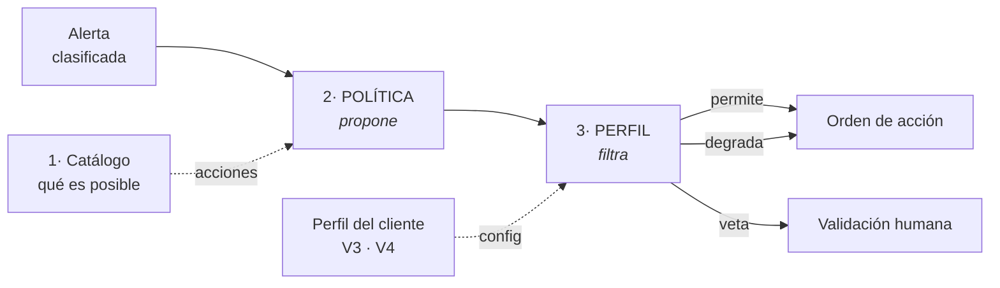

# Política de decisión y perfil de cliente

El [catálogo de acciones](./catalogo-de-acciones.md) dice **qué** puede hacer el motor de triaje. Este
documento define **qué acción corresponde a cada alerta** y **qué está permitido en cada cliente** —
las dos piezas que faltaban para que el sistema pase de clasificar a decidir sin que la decisión la
tome el modelo.

Cierra los requisitos RF-17 a RF-20 y RNF-14, y la actividad del roadmap *«establecer reglas de
decisión y umbrales»*.

---

## 1. Por qué la decisión no la toma el modelo

La tentación fácil sería pedirle al modelo generativo que, además de clasificar, elija la acción. Se
descarta por cuatro razones:

- **Reproducibilidad (RNF-03).** Una tabla es determinista por construcción; un generativo eligiendo
  entre catorce acciones no lo es, ni a temperatura cero.
- **Las abstracciones del diseño.** La [interfaz de análisis](./seleccion-del-modelo.md#5-interfaz-común-lo-que-hace-real-la-escalabilidad)
  devuelve *clase, prioridad y confianza* — no acción. Meter la acción dentro del modelo rompería esa
  frontera.
- **Auditabilidad.** «Esta acción se ordenó porque la política dice que esta clase sobre un activo
  con este servicio expuesto se contiene» es defendible ante coordinación. «Lo dijo el modelo» no.
- **Evaluación.** Si la acción sale de una tabla, un error se atribuye a la clasificación o a la
  política, y se sabe cuál arreglar. Si sale del modelo, todo se mezcla.

---

## 2. El marco de tres capas

La decisión se resuelve con tres capas separadas, cada una con un motivo distinto para cambiar:



| Capa | Qué aporta | Cambia cuando… | Quién la escribe |
|------|-----------|----------------|------------------|
| **1 · Catálogo** | Qué es técnicamente posible | Se añade una capacidad nueva | El proyecto (genérico) |
| **2 · Política** | Qué acción propone una alerta | Cambia la doctrina de respuesta | El proyecto (genérico) |
| **3 · Perfil** | Qué está permitido en este cliente | Se despliega en otro cliente | Se configura por despliegue |

La **política propone**; el **perfil filtra**. El filtro tiene tres salidas y **nunca descarta en
silencio** (RNF-09):

| Salida | Qué hace |
|--------|----------|
| **permite** | La acción sigue tal cual |
| **degrada** | La sustituye por una de menor impacto |
| **veta y escala** | La retiene para validación humana, con su justificación |

Que las tres capas vivan separadas es lo que hace el prototipo adaptable **sin tocar código**
(RNF-14): mismo catálogo, misma política, distinto perfil → decisiones distintas.

---

## 3. La política de decisión

Tabla **determinista** indexada por **clase × postura del activo × criticidad**. La clase sale del
[caso de uso §6](../01-fase1-analisis-del-modulo/caso-de-uso-acotado.md#6-categorías-de-clasificación);
las acciones, del [catálogo](./catalogo-de-acciones.md).

| Clase de la alerta | Acción candidata que **propone** la política | Por qué |
|--------------------|---------------------------------------------|---------|
| **VP · acceso consumado** | `MATAR_CONEXION` de la sesión + `BLOQUEAR_IP` del origen; si persiste, `AISLAR_NODO` | Hay alguien dentro: cortar el acceso vivo primero, contener después |
| **VP · intento de acceso** | `BLOQUEAR_IP` del origen | Contención localizada en el atacante; no toca el servicio |
| **VP · exposición de gestión** | `CERRAR_SERVICIO` o `BLOQUEAR_PUERTO` del servicio mal expuesto | No hay ataque aún: se corrige la configuración que lo permitiría |
| **FP · actividad legítima** | `OBS_*` (registrar) o ninguna | No es amenaza: nada que contener, se deja traza |
| **FP · exposición inexistente** | Ninguna | La postura ya dijo que no hay superficie real |
| **No soportada** | Ninguna → cola manual | Fuera del perímetro, severidad intacta |

Dos ejes modulan la propuesta **antes** de pasar al perfil:

- **La postura del activo** decide si `VP · intento` merece contención o solo observación: fuerza
  bruta SSH contra un nodo con SSH realmente expuesto → `BLOQUEAR_IP`; contra uno sin ese servicio,
  la clase ya habría sido `FP · exposición inexistente`.
- **La criticidad** ([caso de uso §7](../01-fase1-analisis-del-modulo/caso-de-uso-acotado.md#7-criticidad-de-los-activos))
  fija la **prioridad** de la orden — para ordenar la cola de triaje —, no la acción.

> **Principio de mínimo impacto.** La política propone **la acción de menor impacto que resuelve la
> amenaza**. Nunca propone por su cuenta `REINICIAR_NODO` ni `RESTAURAR_CONFIG` — remediación de alto
> impacto que solo llega por escalado humano. Así la degradación del perfil siempre **baja** el
> impacto, nunca lo sube, y el peor caso automático queda acotado por construcción.

---

## 4. El perfil de cliente

Un fichero de configuración versionado, uno por despliegue. Es la instancia de los puntos de
variabilidad [V3 y V4](../01-fase1-analisis-del-modulo/modelo-de-cliente-generico.md#6-puntos-de-variabilidad).

### 4.1 Inventario y criticidad (V4)

Qué activos hay, cuáles importan, y qué servicios presta cada uno de forma legítima —para poder
juzgar «esta acción alcanza un servicio del cliente»:

```yaml
activos:
  servidor-web:   { criticidad: alta,    servicios_prestados: [443, 80] }
  cpe-abonado:    { criticidad: media,   servicios_prestados: [] }
  controlador-ot: { criticidad: critica, servicios_prestados: [502] }   # IoT/OT: valor del cliente
```

La criticidad de IoT/OT no la deduce el prototipo: la aporta el cliente. Es la excepción declarada
en el [caso de uso §7](../01-fase1-analisis-del-modulo/caso-de-uso-acotado.md#7-criticidad-de-los-activos).

### 4.2 Política de continuidad (V3)

Para cada nivel de impacto de una acción (el de RF-17, ver [catálogo](./catalogo-de-acciones.md)),
qué se permite, con excepciones por servicio:

```yaml
continuidad:
  impacto_ninguno:          automatica
  impacto_localizado:       automatica_si_confianza
  impacto_alcanza_servicio: humano_siempre
  reversibilidad_obligatoria: true    # RF-18
  no_cortar_gestion: true             # RF-19
  umbral_confianza: 0.7               # RF-07: umbral de escalado (0.7 por defecto)
excepciones:
  - servicio: 443
    activo: servidor-web
    regla: nunca_automatica           # el 443 del banco se degrada, no se corta solo
```

### 4.3 Cómo lee esto el filtro

Recorrido de un DDoS contra el servidor web de un banco, de punta a punta:

1. La política propone `BLOQUEAR_PUERTO 443` (VP·intento intenso contra el servidor web).
2. El filtro mira el **impacto** de la acción (RF-17: `BLOQUEAR_PUERTO` → `alcanza_servicio`) y la
   **criticidad** del activo (`alta`), y encuentra la excepción del 443 → `nunca_automatica`.
3. **Degrada** a `BLOQUEAR_IP` de los orígenes atacantes (`localizado`, permitido) — que además es la
   respuesta técnicamente mejor: cerrar el puerto le terminaría el trabajo al atacante.
4. Si ni eso resuelve, **veta y escala** a humano con la justificación delante.
5. La traza registra las tres cosas: qué propuso la política, qué vetó el perfil, con qué se quedó.

### 4.4 RF-18 y RF-19 son precondiciones duras, no criterios de escalado

- `reversibilidad_obligatoria` (RF-18) — una acción sin procedimiento de reversión verificable **no
  se propone**. No es «pásala a un humano»: es que no entra en la baraja.
- `no_cortar_gestion` (RF-19) — una acción que dejaría el activo inalcanzable por el plano de gestión
  se **rechaza antes de evaluar su impacto**: impediría la verificación y la siguiente respuesta
  (restricción [C6](../01-fase1-analisis-del-modulo/modelo-de-cliente-generico.md#52-operativas-del-cliente--lo-que-el-prototipo-debe-respetar)).

### 4.5 Nota metodológica

El perfil usa información privilegiada —sabemos qué presta cada activo porque lo declaramos— para
**filtrar**; el clasificador **no** la recibe, debe inferir. Es la misma separación que en el
[dataset de la Fase 3](../03-fase3-entorno-de-pruebas/README.md): el ground truth puede saber cosas
que el modelo debe deducir.

---

## 5. Demostración de la adaptabilidad (RNF-14)

Para el laboratorio se escriben **dos perfiles de ejemplo** —un operador residencial y uno con
clientes empresariales— y se demuestra que la *misma* alerta produce decisiones distintas. Que «se
adapta a varios clientes» deje de ser una afirmación y pase a ser una prueba reproducible es
exactamente lo que RNF-14 exige.

---

## Documentos relacionados

- [Catálogo de acciones](./catalogo-de-acciones.md) — las acciones que la política propone, con su impacto.
- [Caso de uso acotado](../01-fase1-analisis-del-modulo/caso-de-uso-acotado.md) — clases, criticidad y política de continuidad de las que esto deriva.
- [Métricas y evaluación](./metricas-y-evaluacion.md) — las métricas de continuidad que miden si el filtro funciona.
- [Flujo de operación](./flujo-triaje-playbook-sandbox.md) — el contrato de la orden de acción, que lleva el impacto declarado.
- [Modelo de cliente genérico](../01-fase1-analisis-del-modulo/modelo-de-cliente-generico.md#6-puntos-de-variabilidad) — los puntos de variabilidad V3 y V4 que el perfil instancia.
