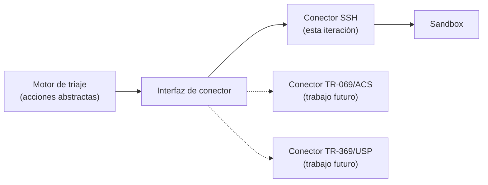

# Protocolos de comunicación con el sandbox

El motor de triaje decide una acción; algo tiene que transportarla hasta el nodo objetivo y devolver su resultado. Este documento evalúa los protocolos candidatos sobre la red del cliente y fija la decisión de diseño.

---

## 1. Los protocolos dependen del tramo

No existe "el protocolo": cada tramo de la red tiene el suyo, con dueño y superficie distintos. Los dos primeros solo aparecen cuando el equipo de borde lo gestiona el proveedor y no el propio cliente.

| Tramo | Protocolo habitual | Naturaleza | ¿Aplicable aquí? |
|-------|--------------------|------------|------------------|
| Tramo del proveedor | **OMCI** (ITU-T G.988) | Gestión interna del plano de transporte | No — fuera del alcance |
| Proveedor → equipo de borde (heredado) | **TR-069 / CWMP** (SOAP sobre HTTP, puerto 7547) | Gestión remota masiva vía ACS | Solo con un ACS de por medio |
| Proveedor → equipo de borde (moderno) | **TR-369 / USP** sobre MQTT, WebSocket o STOMP | Sucesor de TR-069 | Solo con infraestructura USP |
| Acceso directo a equipo | **SSH** | Sesión administrativa | **Sí** |
| Acceso directo (heredado) | Telnet | Sin cifrar | No — solo como *objetivo* a auditar |
| Consulta de estado | **SNMP** | Métricas y trampas | Complementario |
| Configuración estructurada | NETCONF / RESTCONF (YANG) | Configuración transaccional | Solo en equipos que lo soporten |
| Equipo de borde OpenWrt | ubus / LuCI RPC sobre HTTP | API nativa de OpenWrt | Complementario |
| Endpoint final | Agente motor de triaje | Camino clásico | Fuera del sandbox de red |

---

## 2. Comparativa de candidatos

Criterios de evaluación: cobertura de los nodos de la topología, auditabilidad de cada orden, capacidad de devolver el resultado, y esfuerzo de implementación.

| Protocolo | Cobertura en la topología | Auditabilidad | Devuelve resultado | Esfuerzo | Infra. adicional |
|-----------|---------------------------|---------------|--------------------|----------|------------------|
| **SSH** | Total (todos los nodos Linux y OpenWrt) | Alta — orden a orden | Sí, síncrono | Bajo | Ninguna |
| HTTP / REST | Requiere agente propio en cada nodo | Alta | Sí, síncrono | Medio | Agente a desarrollar |
| MQTT | Requiere agente propio y broker | Media | Asíncrono, por tópico | Medio-alto | Broker + agente |
| TR-069 / CWMP | Solo el borde | Alta (en el ACS) | Sí, diferido | **Alto** | **ACS** |
| TR-369 / USP | Solo el borde | Alta | Sí | **Alto** | Controlador USP + broker |
| SNMP | Amplia, pero limitada a escritura de MIB | Baja | Limitado | Bajo | Ninguna |
| NETCONF | Solo equipos con soporte YANG | Alta, transaccional | Sí | Medio | Ninguna |

---

## 3. Decisión: SSH como canal principal

**Se adopta SSH** como transporte de las órdenes de acción del motor de triaje hacia el sandbox.

Motivos:

- **Cobertura completa sin desarrollo previo.** Todos los nodos de la topología —el equipo de borde OpenWrt, el enrutador superior, los servidores y los puestos— hablan SSH de forma nativa. Cualquier otra opción exige desarrollar y desplegar un agente antes de poder ejecutar la primera acción, y ese agente sería trabajo que no contribuye al objetivo del proyecto.
- **Auditabilidad orden a orden.** Cada acción es un comando registrable, con su código de salida y su salida estándar. Eso alimenta directamente el requisito de trazabilidad y el registro de trazas de la Fase 5.
- **Síncrono por defecto.** El motor de triaje obtiene confirmación inmediata de si la acción se aplicó, sin necesidad de un canal de retorno separado.
- **Sin infraestructura adicional.** No hay ACS, ni broker, ni controlador que montar y mantener.
- **Encaja con Containerlab.** El bridge de gestión que Containerlab crea automáticamente está pensado precisamente para acceso SSH out-of-band a los nodos.

### Condiciones de uso

SSH da acceso a una shell completa, lo que es potente y por tanto peligroso. El diseño lo acota:

- El conector expone únicamente el **catálogo cerrado de acciones** definido en el [flujo de operación](./flujo-triaje-playbook-sandbox.md). El motor de triaje **no** emite comandos arbitrarios: selecciona una acción del catálogo, y el conector la traduce al comando concreto.
- Autenticación por **clave, nunca por contraseña**, con una clave dedicada al conector.
- Cuenta de servicio con **los privilegios mínimos** que cada acción requiera.
- Registro de la orden, el comando resultante, el código de salida y la salida completa, asociados al identificador de decisión.

Esta separación es lo que impide que el canal degenere en ejecución remota sin restricciones: la superficie de ataque no es "todo lo que SSH permite", sino el catálogo enumerado.

---

## 4. Por qué no TR-069 / TR-369 ahora

TR-069 es el protocolo con el que un proveedor gestiona un parque de equipos de borde, y TR-369/USP es su sucesor. Diseñar sobre ellos sería el camino de máxima fidelidad operativa.

Se descartan **para esta iteración** porque:

- Ambos requieren infraestructura de servidor —un ACS para TR-069, un controlador USP y un broker MQTT para TR-369— que habría que desplegar y mantener antes de poder ejecutar la primera acción.
- Solo cubren el equipo de borde. Los servidores y el resto de nodos necesitarían un segundo canal de todas formas.
- **No hay hoy un cliente concreto ni un parque de equipos definido**, así que no existe un ACS real al que alinearse. Diseñar contra un ACS hipotético corre el riesgo de acertar en la forma y fallar en el detalle.

**Se documentan como la línea de evolución natural.** Si en algún momento el proyecto se aplica sobre infraestructura real de un proveedor, el canal pasa a ser TR-069 o TR-369.

Para que ese cambio no obligue a rehacer el motor de triaje, el diseño impone una condición: **el motor de triaje emite acciones abstractas, no comandos**. La traducción de acción a comando vive por completo en el conector. Sustituir SSH por un ACS implica entonces escribir un conector nuevo, no tocar la lógica de decisión.

Relevante además desde el punto de vista de seguridad: TR-069 tiene un historial documentado de abuso —el puerto 7547 expuesto ha sido vector de compromiso masivo de equipos de borde— lo que refuerza que sea un **objeto de auditoría** en el sandbox, además de un canal de gestión potencial.

---

## 5. Protocolos complementarios

No sustituyen a SSH, pero pueden aportar en puntos concretos:

- **SNMP** para recolección de estado y métricas de los nodos de red sin abrir sesión. Útil como fuente de telemetría continua, no como canal de acción.
- **ubus / LuCI RPC** en el equipo de borde OpenWrt cuando se requiera configuración estructurada en vez de manipulación de ficheros.
- **Telnet, UPnP y CWMP** aparecen en el sandbox **como objetivos a auditar**, nunca como canal del motor de triaje. Su presencia en un nodo es en sí misma un hallazgo de la auditoría.

---

## 6. Preguntas abiertas

- ¿Debe el conector soportar acciones asíncronas de larga duración (por ejemplo, una captura de tráfico prolongada)? SSH síncrono no encaja bien con eso y requeriría un patrón de trabajo en segundo plano con consulta posterior.
- ¿Cómo se gestionan las credenciales del conector? Un almacén de secretos es lo correcto, pero puede ser desproporcionado para un prototipo.
- Si más adelante entra un endpoint Windows en la topología, ¿se añade WinRM como segundo conector o se instala un servidor SSH?

---

## 6. Cobertura real de SSH: laboratorio vs. cliente de producción

*(Añadido 02/09/2026, tras verificarlo en vivo en el laboratorio.)*

La §3 afirma «cobertura completa» de SSH. **Eso es cierto en el laboratorio** —todos los nodos son Linux
y hablan SSH— pero **no debe leerse como cobertura de los dispositivos de un cliente real**. Verificado en
el lab: el conector alcanza `objetivo-vuln` (SSH + credencial de servicio), pero el resto de nodos, aun
con sshd, no aceptan la credencial única del conector. Extrapolado a un parque real, SSH como **canal de
acción** cubre una porción, no la mayoría:

| Tipo de dispositivo (modelo de cliente, Fase 1) | ¿SSH lo alcanza para *actuar*? |
|---|---|
| Servidores Linux | **Sí** — canal de gestión estándar. |
| Equipo de red / borde (router, switch) | **Parcial** — suelen tener SSH, pero su CLI es propietaria; el catálogo (`iptables`, `service`…) no traduce. |
| Puestos Windows | **No** — gestión por WinRM/RPC/RDP, no SSH nativo. |
| IoT / OT (cámaras, PLC) | **Mayormente no** — sin SSH, o telnet, o protocolos propietarios. |

### La estrategia de integración (lo que sí escala)

Esto **no** es un fallo del diseño, porque la arquitectura ya lo absorbe por dos vías:

1. **SSH es un ejecutor, no *el* mecanismo.** El motor emite acciones **abstractas** del catálogo; el
   conector traduce a comandos. Cubrir más clases de dispositivo es **añadir ejecutores** (WinRM, API de
   firewall, agente EDR) detrás de la misma interfaz —como ya prevé la §3 y el diagrama de conector
   sustituible— sin tocar la lógica de decisión.
2. **En producción, la acción va por los planos de control que el cliente ya tiene** (respuesta activa de
   Wazuh, API del firewall, agente EDR), no por un canal SSH nuevo que abra el triaje. Eso es **RF-13**
   (exponer los resultados al sistema del cliente sin sustituir sus funciones). **SSH-al-nodo es el
   sustituto del laboratorio** de «algún canal de aplicación», no el camino de producción.

**Conclusión para la integración:** para *demostrar* el lazo, SSH sobre un servidor Linux basta. Para
*integrar en un cliente real*, SSH no es la vía única ni mayoritaria: se enrutan las acciones por los
planos de control existentes (RF-13) y se suman ejecutores por clase de dispositivo. La cobertura es una
propiedad del conjunto de ejecutores, no de SSH.

---

## 7. De la contención *host-based* del laboratorio a la integración con firewalls de producción

*(Añadido 02/09/2026. El prototipo se construye en el laboratorio, pero el diseño debe contemplar la
integración en un entorno real; esta sección lo fija.)*

### Qué hace hoy (laboratorio)

La contención actual es **basada en host**: el conector entra por SSH al **propio equipo atacado** y
ejecuta ahí su firewall local. En vivo **no es un simulador** —corre comandos reales— (el «simulador» es
solo el modo `--auto`, con ejecutor falso para los tests sin laboratorio). Lo que ejecuta cada acción del
[catálogo](./catalogo-de-acciones.md):

| Acción | Comando real (en el host víctima) |
|--------|-----------------------------------|
| `BLOQUEAR_IP` | `iptables -A INPUT -s {ip} -j DROP` |
| `BLOQUEAR_PUERTO` | `iptables -A INPUT -p tcp --dport {puerto} -j DROP` |
| `AISLAR_NODO` | `iptables -A FORWARD -s {ip_nodo} -j DROP` |
| `LIMITAR_BANDA` | `tc qdisc add dev {if} root tbf rate {rate}` |
| `CERRAR_SERVICIO` | `service {servicio} stop` |
| `MATAR_CONEXION` | `ss -K dst {ip}` |

**Límite de este enfoque:** bloquear en el host protege *ese* equipo; no bloquea el origen en el resto de
la red. La contención de producción suele querer nivel de **red** (perímetro/segmentación), no host.

### Cómo se integra en producción (sin rediseñar el motor)

La clave: el catálogo es **abstracto** (`BLOQUEAR_IP`) y el conector **traduce** a comando concreto con un
**ejecutor inyectable**. Integrar un firewall real = **escribir un ejecutor nuevo** + su traducción; la
lógica de decisión (política + perfil) **no cambia**. La misma acción abstracta, distinto back-end:

| Destino de producción | Traducción de `BLOQUEAR_IP` |
|-----------------------|-----------------------------|
| **Palo Alto** | API PAN-OS: IP → *Dynamic Address Group* / *External Dynamic List* que una regla ya bloquea |
| **FortiGate** | API REST FortiOS: address object → grupo de bloqueo referenciado por una policy |
| **Cisco (FTD/ASA/IOS-XE)** | API de FMC, o NETCONF/RESTCONF |
| **pfSense / OPNsense** | API: entrada en tabla/alias de pf |
| **Cloud (AWS/Azure/GCP)** | SDK: Security Group / NACL / regla de firewall |
| **La propia pila del cliente** | *active-response* de Wazuh (`firewall-drop`) o su SOAR |

### El cambio conceptual y lo que falta construir

- **Punto de aplicación:** de *host* (iptables en la víctima) → *red* (firewall) o *identidad* (NAC / VLAN
  de cuarentena para `AISLAR_NODO`).
- **Vía de integración — RF-13:** en producción lo idóneo **no** es abrir un canal SSH nuevo a cada equipo,
  sino **enrutar la acción por el plano de control que el cliente ya tiene** (la active-response de Wazuh,
  la API de su firewall, su SOAR). SSH-al-host es el **sustituto del laboratorio** de ese plano.
- **Lo que ya encaja:** la **reversibilidad** (RF-18, cada acción lleva su `reversion_cmd` → las APIs de
  firewall des-bloquean igual), el **verificar-antes-de-actuar** (la API devuelve estado, como hoy
  `iptables -L | grep`), la **idempotencia** y el **catálogo cerrado**.
- **Lo que falta (trabajo futuro honesto):** un **ejecutor por fabricante** (empezando por el firewall del
  cliente o la active-response de Wazuh), un **almacén de secretos** para los tokens de API (hoy el lab usa
  una credencial fija), y el **catálogo de traducción por destino** (acción abstracta → llamada concreta).

**En una frase:** hoy se cierra con `iptables` real en el host por SSH (contención host-based, sustituto de
laboratorio); en producción se añade un ejecutor por firewall/plano de control del cliente detrás de la
misma interfaz, enrutando la acción por lo que el cliente ya tiene — sin tocar el cerebro de triaje.

---

## Documentos relacionados

- [Flujo de operación: logs → playbook → motor de triaje → sandbox](./flujo-triaje-playbook-sandbox.md)
- [Diseño del sandbox: la red del cliente con Containerlab](../03-fase3-entorno-de-pruebas/sandbox-red-containerlab.md)
- [Auditoría de vulnerabilidades del sandbox](./auditoria-de-vulnerabilidades-del-sandbox.md)
