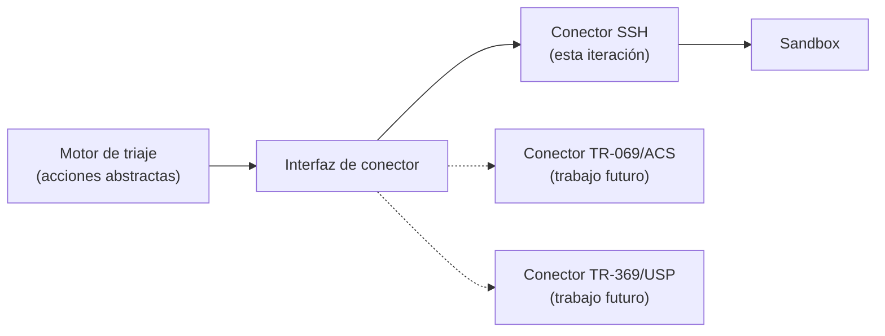

# Protocolos de comunicación con el sandbox

El motor de triaje decide una acción; algo tiene que transportarla hasta el nodo objetivo y devolver su resultado. Este documento evalúa los protocolos candidatos sobre la red del cliente y fija la decisión de diseño.

---

## 1. Los protocolos dependen del tramo

No existe "el protocolo": cada tramo de la red tiene el suyo, con dueño y superficie distintos. Los dos primeros solo aparecen cuando el equipo de borde lo gestiona el proveedor y no el propio cliente.

| Tramo | Protocolo habitual | Naturaleza | ¿Aplicable aquí? |
|-------|--------------------|------------|------------------|
| Tramo del proveedor | **OMCI** (ITU-T G.988) | Gestión interna del plano de transporte | No — fuera del alcance |
| Proveedor → equipo de borde (heredado) | **TR-069 / CWMP** (SOAP sobre HTTP, puerto 7547) | Gestión remota masiva vía ACS | Solo con un ACS de por medio |
| Proveedor → equipo de borde (moderno) | **TR-369 / USP** sobre MQTT, WebSocket o STOMP | Sucesor de TR-069 | Solo con infraestructura USP |
| Acceso directo a equipo | **SSH** | Sesión administrativa | **Sí** |
| Acceso directo (heredado) | Telnet | Sin cifrar | No — solo como *objetivo* a auditar |
| Consulta de estado | **SNMP** | Métricas y trampas | Complementario |
| Configuración estructurada | NETCONF / RESTCONF (YANG) | Configuración transaccional | Solo en equipos que lo soporten |
| Equipo de borde OpenWrt | ubus / LuCI RPC sobre HTTP | API nativa de OpenWrt | Complementario |
| Endpoint final | Agente motor de triaje | Camino clásico | Fuera del sandbox de red |

---

## 2. Comparativa de candidatos

Criterios de evaluación: cobertura de los nodos de la topología, auditabilidad de cada orden, capacidad de devolver el resultado, y esfuerzo de implementación.

| Protocolo | Cobertura en la topología | Auditabilidad | Devuelve resultado | Esfuerzo | Infra. adicional |
|-----------|---------------------------|---------------|--------------------|----------|------------------|
| **SSH** | Total (todos los nodos Linux y OpenWrt) | Alta — orden a orden | Sí, síncrono | Bajo | Ninguna |
| HTTP / REST | Requiere agente propio en cada nodo | Alta | Sí, síncrono | Medio | Agente a desarrollar |
| MQTT | Requiere agente propio y broker | Media | Asíncrono, por tópico | Medio-alto | Broker + agente |
| TR-069 / CWMP | Solo el borde | Alta (en el ACS) | Sí, diferido | **Alto** | **ACS** |
| TR-369 / USP | Solo el borde | Alta | Sí | **Alto** | Controlador USP + broker |
| SNMP | Amplia, pero limitada a escritura de MIB | Baja | Limitado | Bajo | Ninguna |
| NETCONF | Solo equipos con soporte YANG | Alta, transaccional | Sí | Medio | Ninguna |

---

## 3. Decisión: SSH como canal principal

**Se adopta SSH** como transporte de las órdenes de acción del motor de triaje hacia el sandbox.

Motivos:

- **Cobertura completa sin desarrollo previo.** Todos los nodos de la topología —el equipo de borde OpenWrt, el enrutador superior, los servidores y los puestos— hablan SSH de forma nativa. Cualquier otra opción exige desarrollar y desplegar un agente antes de poder ejecutar la primera acción, y ese agente sería trabajo que no contribuye al objetivo del proyecto.
- **Auditabilidad orden a orden.** Cada acción es un comando registrable, con su código de salida y su salida estándar. Eso alimenta directamente el requisito de trazabilidad y el registro de trazas de la Fase 5.
- **Síncrono por defecto.** El motor de triaje obtiene confirmación inmediata de si la acción se aplicó, sin necesidad de un canal de retorno separado.
- **Sin infraestructura adicional.** No hay ACS, ni broker, ni controlador que montar y mantener.
- **Encaja con Containerlab.** El bridge de gestión que Containerlab crea automáticamente está pensado precisamente para acceso SSH out-of-band a los nodos.

### Condiciones de uso

SSH da acceso a una shell completa, lo que es potente y por tanto peligroso. El diseño lo acota:

- El conector expone únicamente el **catálogo cerrado de acciones** definido en el [flujo de operación](./flujo-triaje-playbook-sandbox.md). El motor de triaje **no** emite comandos arbitrarios: selecciona una acción del catálogo, y el conector la traduce al comando concreto.
- Autenticación por **clave, nunca por contraseña**, con una clave dedicada al conector.
- Cuenta de servicio con **los privilegios mínimos** que cada acción requiera.
- Registro de la orden, el comando resultante, el código de salida y la salida completa, asociados al identificador de decisión.

Esta separación es lo que impide que el canal degenere en ejecución remota sin restricciones: la superficie de ataque no es "todo lo que SSH permite", sino el catálogo enumerado.

---

## 4. Por qué no TR-069 / TR-369 ahora

TR-069 es el protocolo con el que un proveedor gestiona un parque de equipos de borde, y TR-369/USP es su sucesor. Diseñar sobre ellos sería el camino de máxima fidelidad operativa.

Se descartan **para esta iteración** porque:

- Ambos requieren infraestructura de servidor —un ACS para TR-069, un controlador USP y un broker MQTT para TR-369— que habría que desplegar y mantener antes de poder ejecutar la primera acción.
- Solo cubren el equipo de borde. Los servidores y el resto de nodos necesitarían un segundo canal de todas formas.
- **No hay hoy un cliente concreto ni un parque de equipos definido**, así que no existe un ACS real al que alinearse. Diseñar contra un ACS hipotético corre el riesgo de acertar en la forma y fallar en el detalle.

**Se documentan como la línea de evolución natural.** Si en algún momento el proyecto se aplica sobre infraestructura real de un proveedor, el canal pasa a ser TR-069 o TR-369.

Para que ese cambio no obligue a rehacer el motor de triaje, el diseño impone una condición: **el motor de triaje emite acciones abstractas, no comandos**. La traducción de acción a comando vive por completo en el conector. Sustituir SSH por un ACS implica entonces escribir un conector nuevo, no tocar la lógica de decisión.

Relevante además desde el punto de vista de seguridad: TR-069 tiene un historial documentado de abuso —el puerto 7547 expuesto ha sido vector de compromiso masivo de equipos de borde— lo que refuerza que sea un **objeto de auditoría** en el sandbox, además de un canal de gestión potencial.

---

## 5. Protocolos complementarios

No sustituyen a SSH, pero pueden aportar en puntos concretos:

- **SNMP** para recolección de estado y métricas de los nodos de red sin abrir sesión. Útil como fuente de telemetría continua, no como canal de acción.
- **ubus / LuCI RPC** en el equipo de borde OpenWrt cuando se requiera configuración estructurada en vez de manipulación de ficheros.
- **Telnet, UPnP y CWMP** aparecen en el sandbox **como objetivos a auditar**, nunca como canal del motor de triaje. Su presencia en un nodo es en sí misma un hallazgo de la auditoría.

---

## 6. Preguntas abiertas

- ¿Debe el conector soportar acciones asíncronas de larga duración (por ejemplo, una captura de tráfico prolongada)? SSH síncrono no encaja bien con eso y requeriría un patrón de trabajo en segundo plano con consulta posterior.
- ¿Cómo se gestionan las credenciales del conector? Un almacén de secretos es lo correcto, pero puede ser desproporcionado para un prototipo.
- Si más adelante entra un endpoint Windows en la topología, ¿se añade WinRM como segundo conector o se instala un servidor SSH?

---

## Documentos relacionados

- [Flujo de operación: logs → playbook → motor de triaje → sandbox](./flujo-triaje-playbook-sandbox.md)
- [Diseño del sandbox: la red del cliente con Containerlab](../03-fase3-entorno-de-pruebas/sandbox-red-containerlab.md)
- [Auditoría de vulnerabilidades del sandbox](./auditoria-de-vulnerabilidades-del-sandbox.md)
