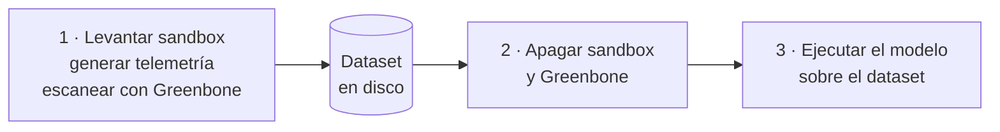
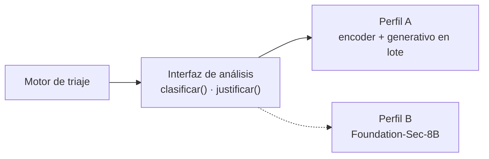

# Selección del modelo de análisis

El prototipo necesita dos capacidades distintas: **clasificar y priorizar** alertas, y **justificar** cada decisión de forma explicable. Este documento fija qué modelos las cubren, bajo qué restricciones de hardware, y cómo se organiza el diseño para que el sistema pueda crecer a equipos más potentes sin reescribirse.

Se definen **dos perfiles de despliegue**: el **Perfil A**, ejecutable en el equipo disponible hoy, y el **Perfil B**, escalable, para cuando se disponga de más recursos.

---

## 1. Criterios de selección

Los requisitos derivados del [análisis de limitaciones de XDR](../02-fase2-estado-del-arte/limitacionesDeXDR.md) acotan la elección antes de mirar ningún modelo:

| Requisito | Exigencia | Consecuencia |
|-----------|-----------|--------------|
| **RNF-01** — Privacidad | Procesamiento local o en entorno aislado | **Descarta toda API alojada.** Solo modelos de pesos abiertos ejecutados en local |
| **RNF-02** — Explicabilidad verificable | Cada afirmación debe referenciar campos concretos de la alerta | Exige capacidad **generativa**: un clasificador no puede redactar |
| **RNF-03** — Reproducibilidad | Misma alerta + misma versión → misma decisión | Modelo y prompt **fijados y versionados**; temperatura mínima |
| **RF-09** — Traza auditable | Registrar versión de modelo y de prompt en cada ejecución | El modelo es parte del registro, no un detalle de implementación |
| **RNF-09** — Disponibilidad | Si el modelo falla, la alerta va a cola manual | Nunca se descarta una alerta en silencio |

A esto se añade un criterio operativo que no procede de los requisitos sino del diseño del flujo: el [disparador de validación humana](./flujo-triaje-playbook-sandbox.md) se activa cuando *«la confianza del clasificador queda por debajo de un umbral»*. Eso pide una **confianza numérica comparable entre alertas** — algo que un clasificador entrega de forma natural (softmax) y que un modelo generativo solo puede autodeclarar, de forma poco fiable.

---

## 2. La restricción real: contención de recursos

El equipo disponible es un portátil con **16 GB de RAM y un AMD Ryzen 7 5700U** (Zen 2, 8 núcleos / 16 hilos, gráfica integrada Radeon Vega 8, **sin GPU dedicada**, DDR4-3200, TDP 15 W).

El factor limitante no es el modelo por sí solo, sino que **el sandbox se ejecuta en la misma máquina**:

| Componente | RAM aproximada |
|------------|----------------|
| Sistema operativo, editor y navegador | 3–4 GB |
| Containerlab: nodo de borde y contenedores de LAN | ~1 GB |
| OpenWrt vía vrnetlab (es una **VM QEMU**, no un contenedor) | 0,5–1 GB |
| Wazuh manager **sin indexer ni dashboard** | 1–2 GB |
| Greenbone (escáner, gestor y base de datos del feed) | 4–8 GB |
| Modelo generativo de 8B cuantizado a 4 bits | ~5 GB |
| **Total si todo coexiste** | **15–21 GB** |

**No cabe.** Y aun cuando entrara raspando, un modelo de 8B en Q4 sobre esta clase de CPU rinde del orden de 6–12 tokens/s según mediciones publicadas —obtenidas en chips de 45 W—, así que en un TDP de 15 W con estrangulamiento térmico cabe esperar menos. Un modelo de razonamiento emite además muchos tokens de pensamiento: una justificación de unos 800 tokens supone **varios minutos por alerta**.

> Las cifras de RAM y de rendimiento son estimaciones a partir del número de parámetros y de mediciones publicadas en hardware comparable. Deben verificarse empíricamente al inicio de la Fase 5.

---

## 3. Perfil A — Equipo actual (CPU, 16 GB)

**Arquitectura: híbrida.** Tres componentes especializados en vez de uno general. No es una elección de elegancia: es lo único que entra en el presupuesto de memoria.

| Función | Componente | Tamaño | Ejecución |
|---------|-----------|--------|-----------|
| Clasificación y prioridad | Encoder de seguridad (SecureBERT 2.0, CySecBERT o SecBERT), con fine-tuning | ~110M par., ~0,5 GB | **Interactiva**, milisegundos en CPU |
| Justificación **breve**, para la validación humana | Modelo pequeño cuantizado: **Phi-4-mini** (3,8B) o **Llama 3.2 3B** | ~2–2,3 GB (Q4) | **Interactiva**, ~15–20 s |
| Justificación **extensa**, para auditoría y evaluación | Foundation-Sec-8B-**Instruct** cuantizado (Q4) | ~5 GB (Q4) | **En lote, fuera de línea** |

**Por qué el encoder para clasificar:** entra sobrado en memoria, responde en milisegundos, es determinista —lo que satisface RNF-03 mejor que cualquier generativo— y entrega la confianza numérica que el umbral de validación humana necesita.

**Por qué un tercer componente de 3B.** Sin él, el Perfil A entraba en contradicción con el propio diseño del flujo: la [validación humana](./flujo-triaje-playbook-sandbox.md) ocurre **antes** de ejecutar la acción y necesita la justificación delante, pero un 8B en lote la produce después. Un modelo de 3B cuantizado ocupa ~2 GB y rinde del orden de 10–12 tokens/s en CPU según mediciones publicadas, así que una justificación breve de unos 200 tokens sale en **15–20 segundos**: tolerable para que una persona decida con el razonamiento a la vista.

El 8B en lote no desaparece: produce la justificación extensa que alimenta la traza de auditoría y la evaluación de la Fase 6, donde la latencia no importa.

**Por qué la variante Instruct y no Reasoning** en el componente de 8B: emite bastantes menos tokens que el modelo de razonamiento, lo que sobre CPU es la diferencia entre viable e impracticable.

**Sobre la elección del encoder:** un estudio comparativo evalúa CTI-BERT, SecureBERT, CySecBERT y SecBERT en condiciones idénticas sobre CTI, phishing, **logs** y CVE, y concluye que hay **fuerte convergencia de rendimiento entre modelos**, y que los fallos vienen del ajuste al dominio y no de la superioridad arquitectónica de ninguno. Conclusión práctica: **no dedicar esfuerzo a elegir entre ellos**. Escoger uno por conveniencia y emplear el tiempo en el ajuste al dominio, que es donde está la diferencia real.

### 3.1 Restricción de ejecución: separación temporal

**El sandbox, Greenbone y el modelo no deben ejecutarse simultáneamente.** El flujo se encadena por fases, usando **el dataset como interfaz**:

**Qué sí puede convivir:** el encoder (~0,5 GB) y el modelo de 3B (~2 GB) son lo bastante ligeros para ejecutarse junto al sandbox y a Wazuh. La separación temporal afecta al **8B en lote** y a **Greenbone**, no al camino interactivo. El lazo cerrado —alerta de Wazuh → clasificación → justificación breve → validación humana → acción por SSH— **sí es demostrable en vivo** en este equipo.

Esto **no degrada la evaluación**: la Fase 6 es batch por naturaleza, así que medir sobre un dataset guardado es exactamente lo que hay que hacer. Lo único que pierde es la demostración del lazo cerrado en vivo — y esa puede realizarse con el encoder solo, que responde en milisegundos, generando las justificaciones en lote a posteriori.

Es una restricción de diseño que afecta a cómo se implementa la Fase 5, no un apaño de última hora.

---

## 4. Perfil B — Equipo con GPU o más memoria

Con una GPU dedicada, o con 32 GB de RAM y tolerancia a una latencia mayor, la arquitectura se simplifica a **un solo componente**.

| Función | Componente |
|---------|-----------|
| Clasificación, prioridad **y** justificación | **Foundation-Sec-8B-Reasoning** (o `-Instruct`) |

[Foundation-Sec-8B](https://huggingface.co/fdtn-ai/Foundation-Sec-8B), de Cisco Foundation AI, es un Llama-3.1-8B con preentrenamiento continuado sobre corpus de seguridad: threat intelligence, bases de vulnerabilidades, documentación de respuesta a incidentes y estándares. La variante [Reasoning](https://huggingface.co/fdtn-ai/Foundation-Sec-8B-Reasoning), publicada el 28 de enero de 2026, declara como objetivo explícito la **aceleración de SOC: triaje y resumen de casos** — el caso de uso de este proyecto.

- Contexto de 32.768 tokens: sobra para una alerta enriquecida con el contexto del auditor.
- Benchmarks reportados: CTI-MCQA 0,691 · CTI-RCM 0,753 · CTI-VSP 0,856 · CTI-Reasoning 0,411.
- Corte de conocimiento: **10 de abril de 2025**. No conoce CVEs ni técnicas posteriores.
- La propia ficha recomienda supervisión humana en decisiones críticas, coherente con el diseño del prototipo.

**Ventaja sobre el Perfil A:** elimina el fine-tuning del encoder y, con él, la necesidad de particionar el dataset en entrenamiento y evaluación. Reduce el proyecto en un componente entero.

**Cautela pendiente:** el modelo base figura con licencia Apache 2.0, pero la ficha de la variante *Reasoning* remite a un `NOTICE.md` y el modelo deriva de Llama-3.1. **Hay que leer esa licencia antes de comprometerse**, porque puede arrastrar condiciones de la Llama Community License.

Incluso en el Perfil B puede convenir conservar el encoder si el umbral de confianza para la validación humana resulta poco fiable con el generativo.

---

## 5. Interfaz común: lo que hace real la escalabilidad

Para que pasar del Perfil A al B sea un cambio de configuración y no una reescritura, **el motor de triaje no invoca modelos: invoca dos operaciones abstractas.**

| Operación | Entrada | Salida |
|-----------|---------|--------|
| `clasificar` | Alerta normalizada y su contexto | Clase, prioridad y **confianza numérica** |
| `justificar` | Alerta, contexto y clase ya decidida | Texto explicable que referencia campos concretos |

Que `clasificar` y `justificar` estén separadas **en la interfaz** aunque el Perfil B las resuelva con un único modelo es deliberado: es lo que permite que un perfil use dos componentes y el otro uno solo sin que el motor de triaje se entere.

Es el mismo principio aplicado en los [protocolos de comunicación](./protocolos-comunicacion-sandbox.md): el motor de triaje emite acciones abstractas y el conector las traduce. Aquí el motor de triaje pide análisis abstracto y el perfil decide con qué se resuelve.

**Consecuencia adicional:** al pasar la clase ya decidida a `justificar`, el componente generativo no decide *qué es* la alerta, solo explica una decisión tomada. Eso reduce la superficie de alucinación y refuerza RNF-02.

---

## 6. Los perfiles no son comparables entre sí

Advertencia metodológica que debe recogerse en el informe de la Fase 7:

**Los resultados obtenidos con el Perfil A y con el Perfil B no son comparables.** Si la evaluación se ejecuta en un perfil y más adelante se repite en el otro, las métricas cambian por el modelo, no por el sistema. Por tanto:

- Una **campaña de evaluación fija el perfil** y no lo cambia a mitad.
- La traza de cada ejecución registra **perfil, modelo, versión y cuantización** (RF-09 ya lo exige para modelo y prompt; se extiende al perfil).
- Si se comparan ambos perfiles, es un **experimento propio** con su propia sección, no una continuación de la campaña anterior.

---

## 7. Candidatos evaluados

| Modelo | Tipo | Tamaño | Clasifica | Justifica | Perfil A | Perfil B |
|--------|------|--------|-----------|-----------|----------|----------|
| [SecBERT](https://huggingface.co/jackaduma/SecBERT) | Encoder | ~110M | Con fine-tuning | No | Sí | Opcional |
| [SecureBERT 2.0](https://arxiv.org/abs/2510.00240) | Encoder | ~110–125M | Con fine-tuning | No | Sí | Opcional |
| [CySecBERT](https://dl.acm.org/doi/10.1145/3652594) | Encoder | ~110M | Con fine-tuning | No | Sí | Opcional |
| Phi-4-mini | Generativo | 3,8B | Limitado | Sí, breve | **Sí, en línea** | Sustituible |
| Llama 3.2 3B | Generativo | 3B | Limitado | Sí, breve | **Sí, en línea** | Sustituible |
| [Foundation-Sec-8B-Instruct](https://huggingface.co/fdtn-ai/Foundation-Sec-8B-Instruct) | Generativo | 8B | Sí | Sí | Solo en lote | Sí |
| [Foundation-Sec-8B-Reasoning](https://huggingface.co/fdtn-ai/Foundation-Sec-8B-Reasoning) | Generativo + razonamiento | 8B | Sí | Sí | **No viable** | **Recomendado** |
| APIs alojadas (cualquiera) | — | — | Sí | Sí | **Descartado por RNF-01** | **Descartado por RNF-01** |

---

## 8. Riesgos y preguntas abiertas

**El fine-tuning del encoder exige datos de entrenamiento distintos del ground truth de evaluación.** Un encoder preentrenado no clasifica alertas: hay que ajustarlo con ejemplos etiquetados. Si se entrena con los mismos nodos vulnerables contra los que luego se mide precisión y recall, **los resultados no valen nada**. Obliga a particionar el dataset de la Fase 3 en entrenamiento y evaluación, con nodos o campañas disjuntos. Afecta solo al Perfil A.

**Desajuste de dominio.** Los encoders de seguridad se preentrenaron sobre *prosa*: informes APT, artículos, papers. La entrada del prototipo son **alertas y logs estructurados de una red FTTx**. Comparten vocabulario técnico pero no género textual. Es medible y barato: comparar el encoder de seguridad contra un BERT genérico sobre las alertas reales es un experimento honesto para la Fase 6.

**Greenbone puede ser demasiado pesado incluso en solitario** en este equipo. Si al desplegarlo se ahoga, la alternativa es Nmap con scripts NSE de vulnerabilidades: menos exhaustivo como dictamen, mucho más ligero. **Debe probarse al inicio de la Fase 3**, no descubrirse en la Fase 6.

**El hardware es un riesgo de proyecto.** Un portátil de 15 W y 16 GB compartido entre el laboratorio de red y el modelo condiciona el alcance de forma seria. Con 32 GB, o con cualquier GPU dedicada, el Perfil B pasa a ser viable y el proyecto gana un componente menos y mejor calidad de razonamiento. **Conviene consultar si existe una máquina de laboratorio disponible** antes de dar la arquitectura por cerrada.

**Licencia de Foundation-Sec.** Pendiente de verificar el `NOTICE.md` de la variante Reasoning (ver §4).

---

## Documentos relacionados

- [Flujo de operación: logs → playbook → motor de triaje → sandbox](./flujo-triaje-playbook-sandbox.md)
- [Protocolos de comunicación con el sandbox](./protocolos-comunicacion-sandbox.md)
- [Auditoría de vulnerabilidades del sandbox](./auditoria-de-vulnerabilidades-del-sandbox.md)
- [Diseño del sandbox: red FTTx con Containerlab](../03-fase3-entorno-de-pruebas/sandbox-red-containerlab.md)
- [Limitaciones de XDR y requisitos derivados](../02-fase2-estado-del-arte/limitacionesDeXDR.md)

## Referencias

- [Foundation-Sec-8B](https://huggingface.co/fdtn-ai/Foundation-Sec-8B) · [Instruct](https://huggingface.co/fdtn-ai/Foundation-Sec-8B-Instruct) · [Reasoning](https://huggingface.co/fdtn-ai/Foundation-Sec-8B-Reasoning) — Cisco Foundation AI
- [SecBERT](https://github.com/jackaduma/SecBERT) — jackaduma
- [SecureBERT](https://github.com/ehsanaghaei/SecureBERT) y [SecureBERT 2.0](https://arxiv.org/abs/2510.00240)
- [CySecBERT](https://dl.acm.org/doi/10.1145/3652594) — ACM TOPS
- [AMD Ryzen 7 5700U — especificaciones](https://en.wikichip.org/wiki/amd/ryzen_7/5700u)
